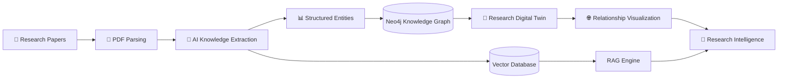
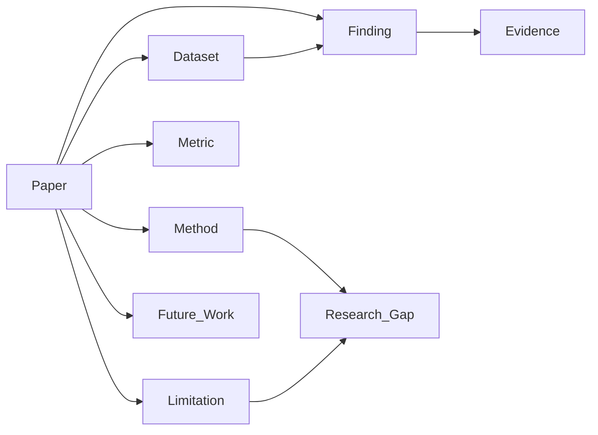
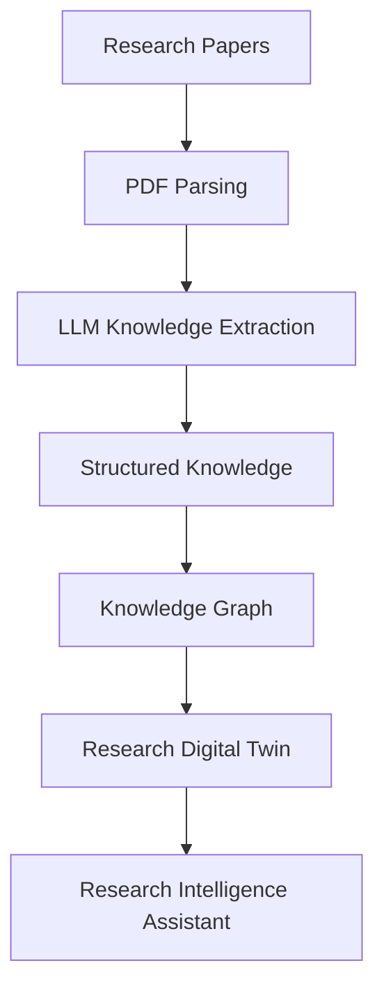
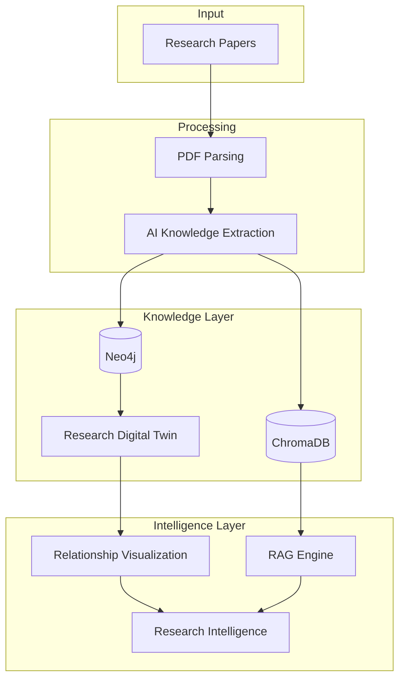
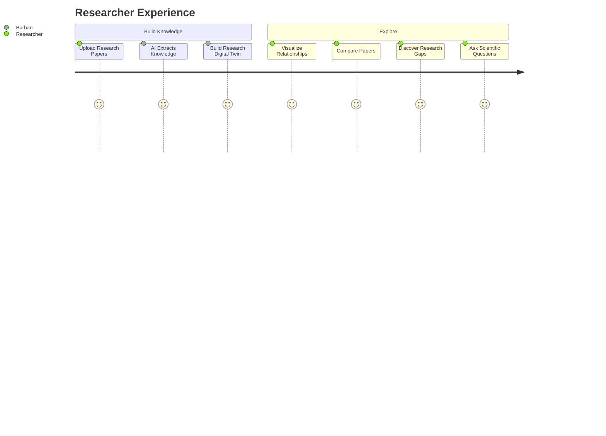

# 🧠 Burhan

### Evidence-Driven Research Intelligence through a Research Digital Twin

*"Transforming research papers into a living representation of scientific knowledge."*

---

# 📖 What is Burhan?

**Burhan** is an AI-powered **Research Digital Twin** that transforms scientific papers into a structured, continuously evolving representation of a research domain.

Unlike traditional AI tools that retrieve information from PDFs, Burhan understands relationships between research papers and builds a living knowledge model that evolves as new papers are added.

Rather than asking:

> *"What does this paper say?"*

Burhan answers:

> *"What does the research field collectively know?"*

---

# 💡 Why "Burhan"?

**Burhan (بُرهان)** is an Arabic word meaning:

- Proof
- Evidence
- Conclusive Argument

Scientific progress is built on evidence—not isolated documents.

Burhan reflects our mission of transforming scattered research papers into **evidence-based research intelligence**.

---

# 🚨 The Problem

Researchers spend countless hours reading papers to answer questions like:

- Which methods perform best?
- Which datasets are most commonly used?
- What limitations appear repeatedly?
- What research gaps still exist?
- Which papers agree or contradict each other?

Current AI tools can search documents.

Very few can understand an entire research field.

---

# 🚀 Our Solution

Burhan converts research papers into a **Research Digital Twin**.

Instead of storing papers as documents, Burhan extracts structured scientific knowledge and connects it into an evolving representation of the domain.

Every uploaded paper enriches the Digital Twin.

This enables:

- Cross-paper reasoning
- Knowledge exploration
- Relationship discovery
- Evidence-backed research gap detection

---

# ✨ Features

- 📄 Multi-paper PDF upload
- 🤖 AI-powered knowledge extraction
- 🧠 Research Digital Twin generation
- 🌐 Knowledge Graph visualization
- 🔍 Cross-paper comparison
- 💬 Evidence-grounded AI Assistant
- 📊 Research trend exploration
- 🎯 Research gap identification
- 🔄 Automatic Digital Twin updates

---

# 🏗 System Workflow

---

# 🧬 Research Digital Twin

The Digital Twin models relationships between scientific entities instead of isolated documents.

---

# 🔄 Knowledge Extraction Pipeline

---

# 🏛 System Architecture

---

# 👨‍🔬 Researcher Journey

---

# 📊 Digital Twin Structure

Each uploaded paper contributes structured knowledge to the Digital Twin.

| Entity | Examples |
|----------|-----------|
| 📄 Paper | Research article |
| ⚙️ Method | CNN, Transformer, YOLO |
| 🗂 Dataset | COCO, ImageNet |
| 📏 Metric | Accuracy, F1-score |
| 📈 Finding | Experimental result |
| ⚠️ Limitation | Small dataset |
| 🚀 Future Work | Suggested improvements |
| 🎯 Research Gap | Missing comparison or unexplored direction |

---

# 🤖 Research Intelligence

Unlike traditional document retrieval systems, Burhan reasons over structured scientific knowledge.

Researchers can ask questions such as:

- Which datasets are used most frequently?
- Which methods consistently outperform others?
- What limitations recur across studies?
- Which findings contradict each other?
- Which research gaps are supported by evidence?
- Which papers use the same methodology?

---

# 🛠 Technology Stack

| Layer | Technology |
|---------|------------|
| Frontend | Next.js + React |
| Backend | FastAPI |
| AI Models | OpenAI GPT / Gemini |
| PDF Processing | PyMuPDF + Docling |
| Knowledge Graph | Neo4j |
| Vector Database | ChromaDB |
| Visualization | React Flow / Cytoscape.js |
| Embeddings | OpenAI / Gemini |

---

# 🎯 MVP Scope

The hackathon prototype focuses on a single research domain.

✅ Upload research papers

✅ Extract structured knowledge

✅ Build a Research Digital Twin

✅ Visualize relationships

✅ Compare papers

✅ Answer evidence-grounded questions

✅ Detect research gaps

---

# 🔮 Future Vision

Burhan is designed to evolve beyond a research assistant.

Future capabilities include:

- Integration with arXiv and Semantic Scholar
- Citation network analysis
- Research trend prediction
- Automatic literature reviews
- Multi-agent scientific reasoning
- Dynamic Digital Twin updates from newly published papers

---

# 🌟 What Makes Burhan Different?

| Traditional RAG | Burhan |
|-----------------|---------|
| Chat with PDFs | ✅ |
| Semantic Search | ✅ |
| Knowledge Graph | ✅ |
| Research Digital Twin | ✅ |
| Cross-paper Reasoning | ✅ |
| Automatic Domain Evolution | ✅ |
| Evidence-based Research Gaps | ✅ |
| Scientific Knowledge Representation | ✅ |

---

# 👥 Team

Developed for **Farq Hackathon**

**Imam Abdulrahman Bin Faisal University**

- Farah Almujaljel
- Aryam Bargash
- Alaa Bughararah
- Raneem Bahobail
- Batool Ashour

### Mentor

Dr. Muzammil

Assistant Professor of AI — KFUPM

Director — BRAIN Lab

---

# 📜 License

This project is licensed under the MIT License.

---

### ⭐ Burhan

*"From research papers to research intelligence."*

