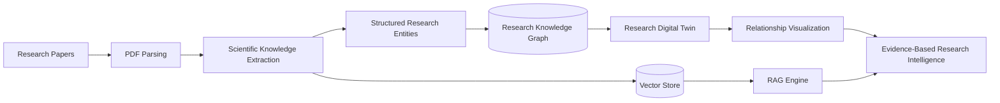
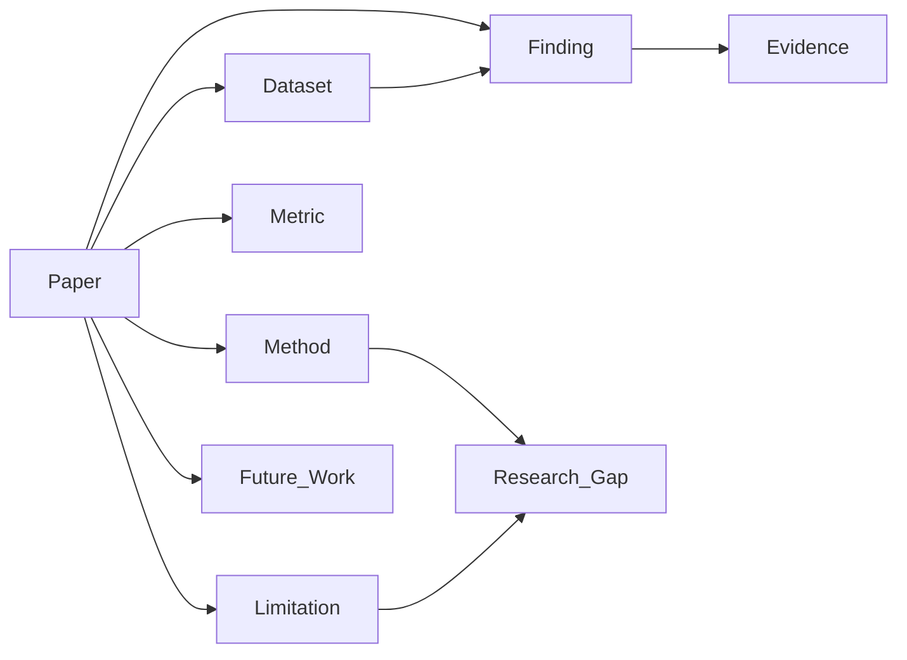
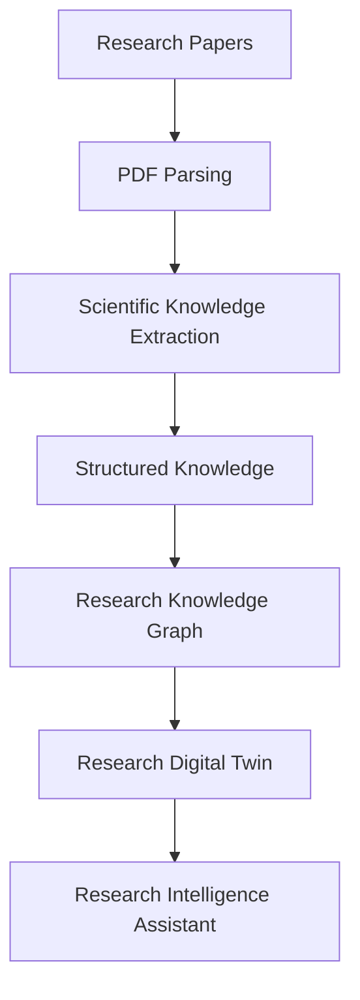
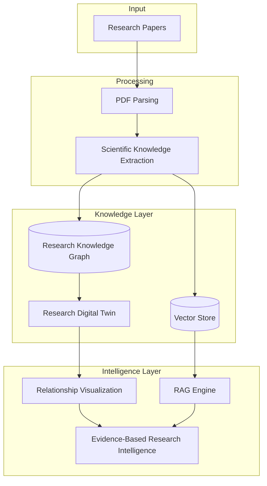
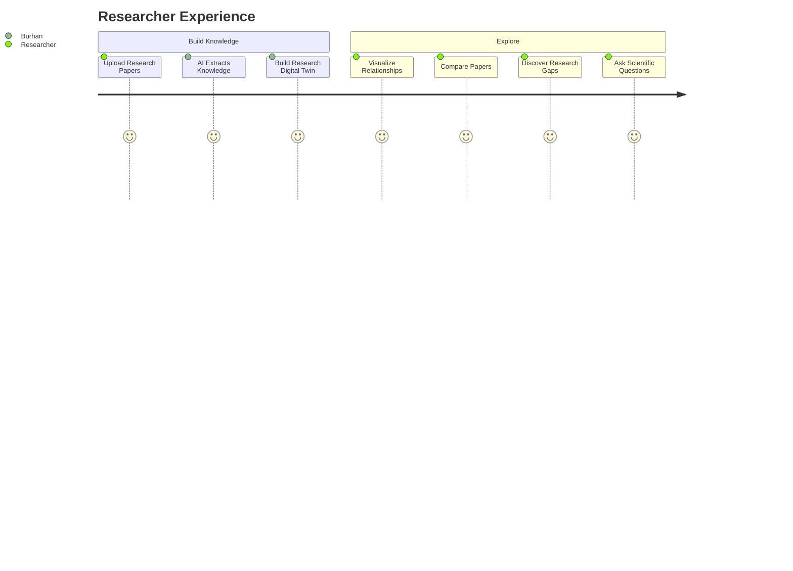

#  Burhan | بُرهان

### Evidence-Driven Research Intelligence through a Research Digital Twin

*"Transforming research papers into a living representation of scientific knowledge."*

---

# 📖 Overview

**Burhan** is an AI-powered **Research Digital Twin** that transforms collections of scientific papers into a structured, continuously evolving representation of a research domain.

Unlike traditional AI research assistants that retrieve information from PDFs, Burhan extracts scientific knowledge, models relationships across papers, and builds an evidence-based Digital Twin capable of reasoning over an entire research field.

Instead of asking:

> *"What does this paper say?"*

Burhan answers:

> *"What does the research field collectively know?"*

---

# 💡 Why Burhan?

**Burhan (بُرهان)** is an Arabic word meaning:

- Proof
- Evidence
- Conclusive Argument

Scientific progress is built on evidence—not isolated documents.

Burhan reflects our mission to transform scattered research papers into **evidence-driven research intelligence**.

---

# 🚨 The Problem

Understanding a research field requires reading dozens—or even hundreds—of papers.

Researchers spend significant time answering questions like:

- Which methods perform best?
- Which datasets are most widely used?
- What limitations recur across studies?
- Where are the research gaps?
- Which findings support or contradict each other?

Current AI tools can search documents.

Very few can understand an entire research domain.

---

# 🚀 Our Solution

Burhan builds a **Research Digital Twin**.

Instead of storing research papers as isolated documents, Burhan extracts structured scientific knowledge and connects it into a living representation of the research domain.

Every uploaded paper enriches and updates the Digital Twin.

The result is an AI system capable of:

- Cross-paper reasoning
- Scientific knowledge exploration
- Relationship discovery
- Evidence-backed research gap detection
- Research intelligence

---

# ✨ Features

- 📄 Upload multiple research papers
- 🤖 AI-powered scientific knowledge extraction
- 🧬 Research Digital Twin generation
- 🌐 Research Knowledge Graph
- 🔍 Cross-paper comparison
- 💬 Evidence-grounded AI assistant
- 📊 Relationship visualization
- 🎯 Research gap detection
- 🔄 Continuous Digital Twin evolution

---

# 🏗️ System Workflow

---

# 🧬 Research Digital Twin

The Digital Twin represents scientific knowledge through interconnected research entities.

---

# 🔄 Knowledge Extraction Pipeline

---

# 🏛️ System Architecture

---

# 👨‍🔬 Researcher Journey

---

# 📊 Research Digital Twin Structure

Every uploaded paper contributes structured scientific knowledge.

| Entity | Examples |
|---------|----------|
| Paper | Research article |
| Method | CNN, Transformer, YOLO |
| Dataset | COCO, ImageNet |
| Metric | Accuracy, Precision, Recall, F1-score |
| Finding | Experimental result |
| Limitation | Small dataset, computational cost |
| Future Work | Suggested improvements |
| Research Gap | Missing comparisons, underexplored datasets |

---

# 🤖 Research Intelligence

Burhan reasons over the **Research Digital Twin**, not only retrieved document chunks.

Researchers can ask questions such as:

- Which datasets are most frequently used?
- Which methods consistently outperform others?
- What limitations recur across studies?
- Which findings contradict one another?
- Which research gaps are supported by evidence?
- Which papers use similar methodologies?
- How does the research landscape evolve as new papers are added?

---

# 🛠️ Technology Stack

| Layer | Technology |
|--------|------------|
| Frontend | Next.js + React |
| Backend | FastAPI |
| LLM | OpenAI GPT / Gemini |
| PDF Processing | PyMuPDF + Docling |
| Research Knowledge Graph | Neo4j |
| Vector Store | ChromaDB |
| Graph Visualization | React Flow / Cytoscape.js |
| Embeddings | OpenAI / Gemini |

---

# 🎯 MVP Scope

The first version focuses on a single research domain.

### Included

- ✅ Upload multiple research papers
- ✅ Extract structured scientific knowledge
- ✅ Build a Research Digital Twin
- ✅ Generate a Research Knowledge Graph
- ✅ Visualize relationships
- ✅ Compare papers
- ✅ Evidence-grounded AI assistant
- ✅ Detect research gaps

### Out of Scope

- Authentication
- Collaboration
- Citation management
- Web search
- Multi-language support
- Large-scale indexing

---

# 🌟 What Makes Burhan Different?

| Traditional RAG Systems | Burhan |
|--------------------------|---------|
| Chat with PDFs | ✅ |
| Semantic Search | ✅ |
| Cross-paper Comparison | ✅ |
| Research Knowledge Graph | ✅ |
| Research Digital Twin | ✅ |
| Automatic Domain Evolution | ✅ |
| Evidence-Based Research Gap Detection | ✅ |
| Scientific Knowledge Representation | ✅ |

---

# 🔮 Future Vision

Burhan is the foundation for a continuously evolving scientific knowledge platform.

Future capabilities include:

- Live integration with arXiv and Semantic Scholar
- Citation network analysis
- Automatic literature reviews
- Research trend prediction
- Multi-agent scientific reasoning
- Continuous Digital Twin updates from newly published research

---

# 👥 Team

Developed for the **Farq Hackathon**

**Imam Abdulrahman Bin Faisal University**

- Farah Almujaljel
- Aryam Bargash
- Alaa Bughararah
- Raneem Bahobail
- Batool Ashour

### Mentor

**Dr. Muzammil**

Assistant Professor of Artificial Intelligence — KFUPM  
Director — BRAIN Lab

---

# 📄 License

This project is licensed under the MIT License.

---

## Burhan

### *From Research Papers to Research Intelligence.*

**Building the next generation of evidence-driven scientific discovery through a Research Digital Twin.**

