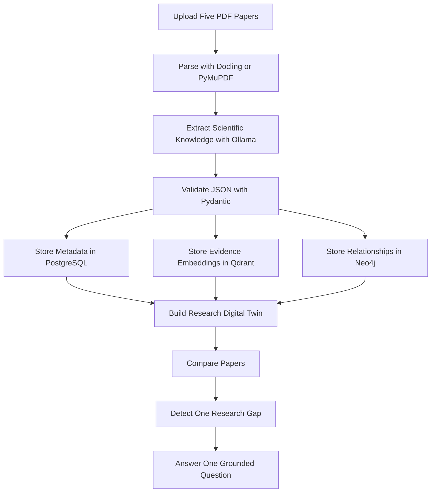

<div align="center">

# Burhan | برهان

## Agentic AI Research Scientist

### Building Living Research Digital Twins

Burhan is a focused FARQ Hackathon MVP that turns five uploaded research papers into structured scientific knowledge, a graph-backed Research Digital Twin, one evidence-backed research gap, and one grounded research answer.


</div>

## About

Burhan is an Agentic AI Research Scientist. The product is not a PDF chatbot and not a search engine. The product continuously builds a Research Digital Twin: a living intelligence layer that represents papers, methods, datasets, metrics, findings, limitations, evidence, relationships, contradictions, and research gaps.

This repository implements one complete proof-of-concept workflow for the FARQ Hackathon.

## MVP Workflow



## Implemented Demo Screens

The frontend has exactly six screens:

1. Upload
2. AI Analysis
3. Structured Extraction
4. Knowledge Graph
5. Research Gap
6. Ask Burhan

Everything shown in the UI is wired to backend outputs. Features outside the MVP scope, such as authentication, projects, teams, notifications, scheduling, and multi-user support, are intentionally excluded.

## Tech Stack

| Layer | Technology |
|---|---|
| Frontend | Next.js, Tailwind, React Flow |
| Backend | FastAPI |
| AI | Ollama local API at `http://localhost:11434/v1` |
| Local LLM | `llama3.2:3b` |
| Embeddings | Local deterministic evidence vectors for Qdrant |
| Knowledge Graph | Neo4j |
| Vector DB | Qdrant |
| Parser | Docling when installed, PyMuPDF fallback |
| Validation | Pydantic |
| Metadata Store | PostgreSQL |

## Quick Start

Start the data services:

```bash
docker compose up -d
```

Run the backend:

```bash
cd backend
python -m venv .venv
source .venv/bin/activate
pip install -r requirements.txt
cp .env.example .env
uvicorn app.main:app --reload
```

Run Ollama locally and pull the configured model:

```bash
ollama pull llama3.2:3b
ollama serve
```

The backend defaults to `LLM_BASE_URL=http://localhost:11434/v1` and `LLM_MODEL=llama3.2:3b`.

Optional Docling parser support:

```bash
pip install -r requirements-docling.txt
```

Run the frontend:

```bash
cd frontend
npm install
cp .env.example .env.local
npm run dev
```

Open `http://localhost:3000`.

## Required Demo Input

Upload exactly five PDF papers in one domain. The intended FARQ demo topic is:

**Breast Cancer Detection using AI**

## API

FastAPI docs are available at:

```text
http://127.0.0.1:8000/docs
```

Core endpoints:

- `POST /api/runs`: upload exactly five PDFs and build the twin.
- `GET /api/runs/{run_id}`: retrieve a completed run.
- `POST /api/runs/{run_id}/ask`: ask the grounded research question.

## Documentation

- [Architecture](docs/ARCHITECTURE.md)
- [Setup](docs/SETUP.md)
- [API Documentation](docs/API.md)
- [FARQ Execution Proposal](docs/FARQ_EXECUTION_PROPOSAL.md)

## FARQ Scope

Burhan optimizes for FARQ evaluation evidence rather than feature count:

- visible progress from papers to knowledge;
- structured scientific extraction;
- graph-backed Research Digital Twin;
- cross-paper reasoning;
- evidence-backed research gap detection;
- grounded answer with citations.
