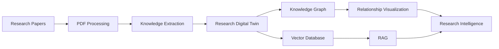
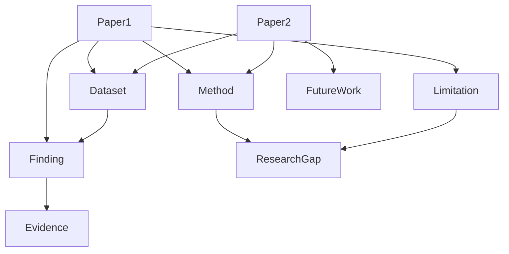
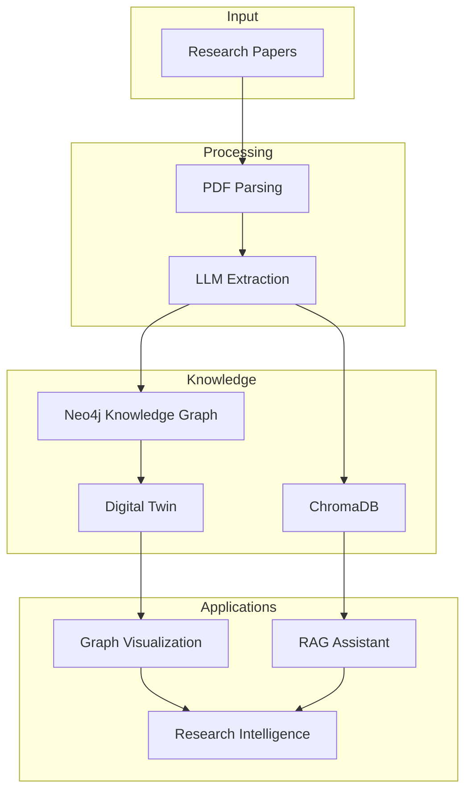

<div align="center">

# Burhan
### 🧠 Building a Research Digital Twin for Scientific Knowledge

*"From research papers to research intelligence."*


</div>

---

## 📖 Overview

**Burhan** is an AI-powered **Research Digital Twin** that transforms scientific papers into a living, evolving representation of a research domain.

Unlike traditional RAG systems that simply retrieve passages from PDFs, Burhan continuously extracts structured scientific knowledge, models relationships across papers, and builds an evidence-based Digital Twin capable of answering research questions, comparing studies, and identifying research gaps.

> **RAG is only one subsystem.**
>
> **The Research Digital Twin is the core innovation.**

---

# 🎯 Problem

Researchers spend countless hours reading dozens of papers just to understand:

- Which methods perform best?
- Which datasets are commonly used?
- What limitations recur across studies?
- Where are the real research gaps?

Current AI tools can search papers.

Burhan helps researchers **understand an entire research field.**

---

# 💡 Solution

Instead of storing research papers as documents...

Burhan converts them into an interconnected scientific knowledge representation.

Every uploaded paper updates the Digital Twin, enabling the system to reason across the entire collection rather than individual documents.

---

# ✨ Features

- 📄 Multi-paper PDF upload
- 🧠 AI-powered scientific information extraction
- 🕸️ Research Knowledge Graph
- 🔄 Continuously evolving Research Digital Twin
- 📊 Interactive relationship visualization
- 🔍 Cross-paper comparison
- 📚 Evidence-grounded AI Assistant
- 🎯 Research gap detection
- 📈 Domain evolution over time

---

# 🏗 System Workflow



---

# 🧠 Research Digital Twin

The Digital Twin models relationships between scientific entities instead of isolated documents.



---

# 🔄 Knowledge Extraction Pipeline

```mermaid
flowchart TD

PDF

-->

Parser

-->

LLM Extraction

-->

Structured Knowledge

-->

Knowledge Graph

-->

Digital Twin

-->

Research Assistant
```

---

# 📊 Digital Twin Structure

Each uploaded paper contributes structured scientific knowledge.

| Entity | Examples |
|----------|----------|
| Paper | YOLOv8 Paper |
| Method | CNN, Transformer |
| Dataset | COCO, ImageNet |
| Metric | Accuracy, F1 |
| Finding | Highest reported performance |
| Limitation | Small dataset |
| Future Work | Real-time deployment |
| Research Gap | Missing benchmark comparisons |

---

# 🤖 AI Assistant

Instead of asking:

> What does Paper A say?

Users ask:

- Which datasets appear most frequently?
- Which methods outperform others?
- What limitations are repeated?
- Which research gaps are supported by evidence?
- Which papers contradict each other?

The assistant reasons over the **Digital Twin**, not only retrieved document chunks.

---

# 🏛 Architecture



---

# ⚙ Tech Stack

| Layer | Technology |
|---------|------------|
| Frontend | Next.js + React |
| Backend | FastAPI |
| LLM | OpenAI GPT / Gemini |
| PDF Parsing | PyMuPDF + Docling |
| Knowledge Graph | Neo4j |
| Vector Database | ChromaDB |
| Visualization | React Flow / Cytoscape |
| Embeddings | OpenAI / Gemini |

---

# 🚀 MVP

The first version focuses on one research domain.

✅ Upload papers

✅ Extract structured knowledge

✅ Build Digital Twin

✅ Visualize relationships

✅ Compare papers

✅ Evidence-backed Q&A

✅ Research gap detection

---

# 🌍 Vision

Burhan is not another "Chat with PDFs."

It is the first step toward an evolving **Research Digital Twin** capable of representing scientific knowledge as a living, interconnected system that grows with every new publication.

---

# 👥 Team

Developed for the **Farq Hackathon 2026**

**Imam Abdulrahman Bin Faisal University**

- Farah Almujaljel
- Aryam Bargash
- Alaa Bughararah
- Raneem Bahobail
- Batool Ashour

Mentor

- Dr. Muzammil

---

# 📜 License

MIT License
