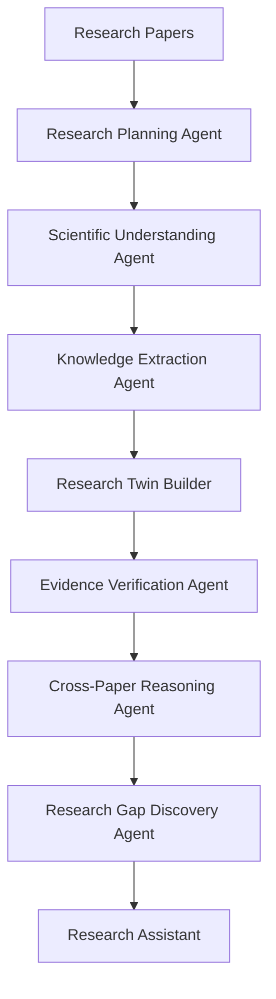
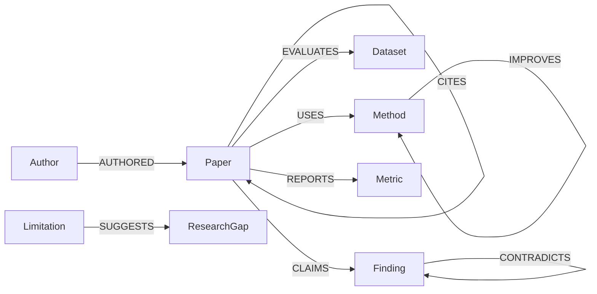

<div align="center">

# Burhan | برهان

## Agentic AI Research Scientist

### Building Living Research Digital Twins

Burhan is an Agentic AI Research Scientist that reads research papers, extracts structured scientific knowledge, builds a continuously evolving Research Digital Twin, and reasons across evidence to help researchers understand what a field collectively knows.

The Research Digital Twin is not the product positioning. It is Burhan's core intelligence layer: a living representation of papers, methods, datasets, metrics, findings, limitations, evidence, contradictions, trends, and research gaps.


</div>

## Problem

Researchers do not only need to read papers. They need to understand how a research field behaves across many papers:

- Which methods are used, compared, and improved?
- Which datasets and metrics define the field?
- Which findings are strongly supported by evidence?
- Which claims contradict each other?
- Which limitations repeat across studies?
- Which research gaps are actionable?

Most research tools optimize individual tasks such as search, summarization, citation discovery, or PDF question answering. These are useful, but they do not build a structured model of scientific understanding that evolves as new papers are added.

## Vision

Burhan's vision is to move from document-level assistance to field-level scientific intelligence.

Instead of treating each paper as an isolated PDF, Burhan turns research papers into a connected knowledge layer. Agentic AI components plan the research workflow, extract scientific entities, verify evidence, reason across papers, and surface gaps.

## Why Existing Solutions Are Not Enough

Existing systems such as Elicit, Consensus, Connected Papers, ResearchRabbit, SciSpace, Semantic Scholar, Litmaps, and scite each support important parts of the research workflow. They help with literature search, paper understanding, citation exploration, evidence synthesis, and citation context.

Burhan focuses on a different layer: Scientific Knowledge Intelligence.

| Category | Existing tools commonly optimize | Burhan's focus |
|---|---|---|
| Literature search | Finding relevant papers | Turning selected papers into structured scientific knowledge |
| Paper understanding | Summaries and Q&A | Extracting methods, datasets, metrics, findings, limitations, and evidence |
| Citation graphs | Paper-to-paper relationships | Scientific relationships between concepts, claims, methods, and gaps |
| Evidence synthesis | Answers from retrieved sources | Cross-paper reasoning over a living Research Digital Twin |
| Research planning | Manual interpretation by the researcher | Agentic discovery of contradictions, gaps, and next research directions |

## Our Innovation

Burhan does not introduce a new LLM. Its innovation is the orchestration of:

- Agentic AI workflows
- Scientific Knowledge Graph construction
- Research Digital Twin evolution
- Cross-paper reasoning
- Evidence-grounded retrieval
- Structured scientific information extraction

Together, these components allow Burhan to build and update an evidence-backed model of a research domain rather than simply answer questions over document chunks.

## Architecture



The pipeline is agentic but grounded. Each agent has a specific responsibility, and outputs are validated before they are added to the twin.

## AI Methodology

Burhan combines several AI methods, each selected for a specific role:

- Agentic AI coordinates the research workflow instead of relying on one monolithic prompt.
- LLM reasoning interprets scientific text and extracts structured claims.
- Scientific information extraction converts papers into validated entities and relationships.
- A Knowledge Graph represents scientific structure explicitly.
- Retrieval-Augmented Generation grounds assistant responses in evidence.
- Cross-paper reasoning compares claims, methods, datasets, and limitations across the field.
- Evidence verification checks that extracted findings remain linked to source text.
- Research gap detection aggregates limitations, future work, contradictions, and underexplored relationships.

See [docs/AI_METHODOLOGY.md](docs/AI_METHODOLOGY.md) for the detailed methodology.

## Research Digital Twin

Burhan's Research Digital Twin is a living intelligence layer that represents:

- Papers
- Methods
- Datasets
- Metrics
- Findings
- Limitations
- Future work
- Evidence
- Relationships
- Contradictions
- Research gaps
- Trends

Every new uploaded paper can update the twin by adding entities, strengthening existing relationships, introducing contradictions, or suggesting new research gaps.

## Scientific Knowledge Graph

The Scientific Knowledge Graph is the structured representation inside the twin.



Core node types include Paper, Method, Dataset, Metric, Finding, Limitation, Research Gap, and Author. Core relationships include USES, EVALUATES, COMPARES, CITES, IMPROVES, CONTRADICTS, and SUGGESTS.

## Tech Stack

| Layer | Recommended technology | Why it fits Burhan |
|---|---|---|
| LLM | GPT-5 preferred, GPT-4.1 fallback | Strong reasoning and structured extraction for scientific text |
| Embeddings | text-embedding-3-large | High-quality semantic retrieval for evidence grounding |
| Agent framework | LangGraph | Explicit multi-agent orchestration with stateful workflows |
| Knowledge graph | Neo4j | Native graph storage for scientific entities and relationships |
| Vector database | Qdrant | Scalable evidence retrieval for RAG support |
| Parsing | Docling, PyMuPDF | PDF-to-structured-text extraction for research papers |
| Validation | Pydantic | Strict schemas for extracted entities and relationships |
| Backend | FastAPI | Python-native APIs for AI services and prototype delivery |
| Frontend | Next.js | Interactive dashboard and graph visualization experience |

See [docs/TECH_STACK.md](docs/TECH_STACK.md) for implementation rationale.

## MVP

The FARQ MVP focuses on one research domain and proves the core workflow:

- Upload or select multiple research papers.
- Parse paper text and sections.
- Extract structured scientific entities.
- Validate entities and evidence.
- Build a Scientific Knowledge Graph.
- Construct the Research Digital Twin.
- Show cross-paper comparisons.
- Detect repeated limitations and research gaps.
- Provide grounded answers using RAG as a support subsystem.

## Roadmap

- Prototype: paper ingestion, structured extraction, graph visualization, and twin dashboard.
- MVP: multi-paper reasoning, gap cards, evidence verification, and grounded research assistant.
- Research platform: continuous updates, richer graph analytics, user feedback loops, and integrations with scholarly data sources.

See [docs/ROADMAP.md](docs/ROADMAP.md) and [docs/MVP_PLAN.md](docs/MVP_PLAN.md).

## Getting Started

The prototype is under active, incremental development. Currently implemented: backend foundation, the validated data contract (entities, relations, evidence, twin), PDF ingestion (multi-file upload, page-aware parsing, section detection, traceable chunking), evidence-verified scientific extraction with Groq, the Research Digital Twin (entity resolution, knowledge graph, local-embedding evidence index, change tracking), and the Next.js frontend (twin dashboard, papers, knowledge graph, evidence search, twin evolution).

```bash
python3 -m venv .venv
make install
cp .env.example .env   # add your GROQ_API_KEY
make test
make dev               # API: http://localhost:8000/docs
make frontend-install && make frontend-dev   # UI: http://localhost:3000
```

Neo4j and Qdrant are optional (`make infra-up`); the defaults use in-memory and local fallbacks. See [docs/DEVELOPMENT.md](docs/DEVELOPMENT.md).

## Team

Developed for the FARQ Hackathon.

| Name | Role |
|---|---|
| Farah Almujaljel | Product Lead & Research Twin Architect |
| Aryam Bargash | AI/LLM Engineer |
| Alaa Bughararah | Knowledge Graph & Data Engineer |
| Raneem Bahobail | Backend & System Integration |
| Batool Ashour | Frontend, UI/UX & Visualization |

Mentor: Dr. Muzammil, Assistant Professor of AI, KFUPM.

## Documentation

- [AI Methodology](docs/AI_METHODOLOGY.md)
- [Architecture](docs/ARCHITECTURE.md)
- [Tech Stack](docs/TECH_STACK.md)
- [Competitive Analysis](docs/COMPETITIVE_ANALYSIS.md)
- [MVP Plan](docs/MVP_PLAN.md)
- [Development](docs/DEVELOPMENT.md)
- [FARQ Execution Proposal](docs/FARQ_EXECUTION_PROPOSAL.md)
- [Video Script](docs/VIDEO_SCRIPT.md)
- [Team](docs/TEAM.md)
- [Roadmap](docs/ROADMAP.md)

## License

This project is licensed under the MIT License.
