# Burhan — Technical Schematic

> **Agentic AI Research Scientist**
>
> Technical architecture and system workflow for Burhan's Research Digital Twin.

---

# System Overview

Burhan transforms unstructured scientific literature into a continuously evolving **Research Digital Twin (RDT)**.

Unlike traditional RAG systems, Burhan builds structured scientific knowledge that supports evidence-grounded reasoning across an entire research domain.

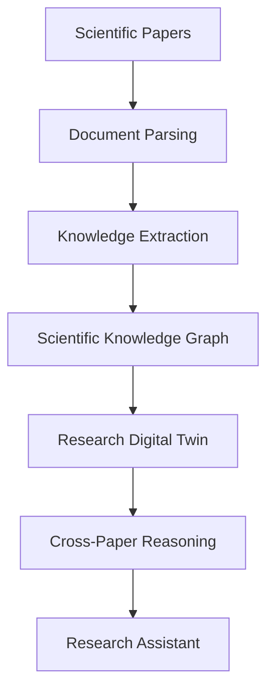

---

# Core Intelligence Layer

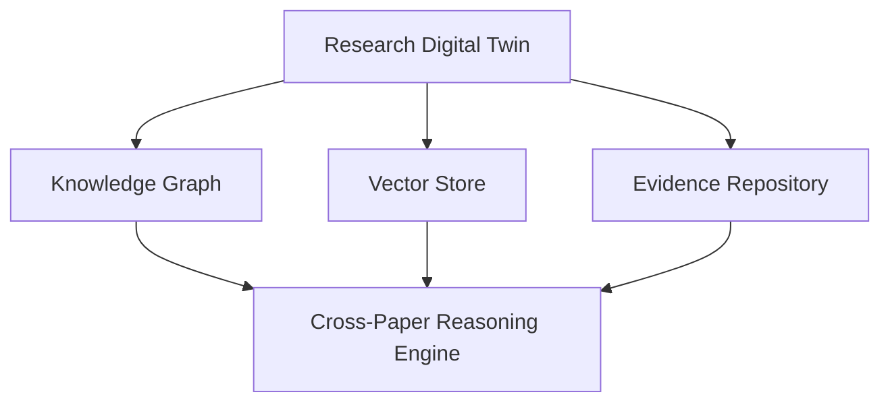

The Research Digital Twin is Burhan's persistent scientific memory.

It continuously evolves as new papers are uploaded.

---

# End-to-End Processing Pipeline

```mermaid
flowchart LR

    A[Scientific PDFs]

    B[Document Parsing<br/>Docling / PyMuPDF]

    C[Scientific Understanding Agent]

    D[Knowledge Extraction Agent]

    E[Evidence Validation]

    F[Scientific Knowledge Graph]

    G[Research Digital Twin]

    H[Cross-Paper Reasoning]

    I[Research Assistant]

    A --> B
    B --> C
    C --> D
    D --> E
    E --> F
    F --> G
    G --> H
    H --> I
```

---

# Multi-Agent Architecture

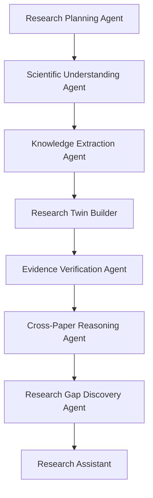

---

# Scientific Knowledge Graph

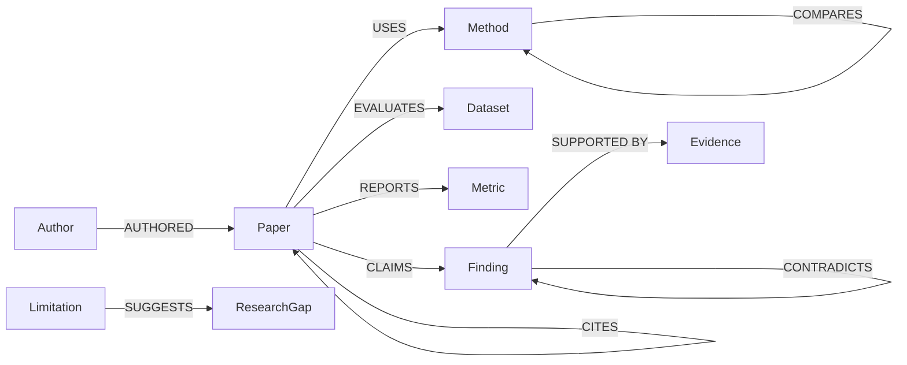

---

# Scientific Entity Extraction

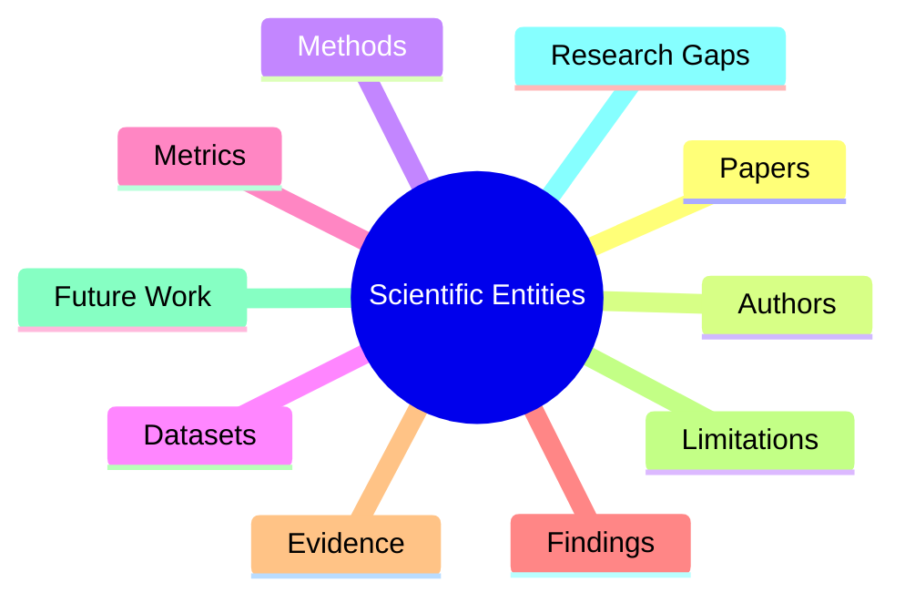

---

# AI Methodology Stack

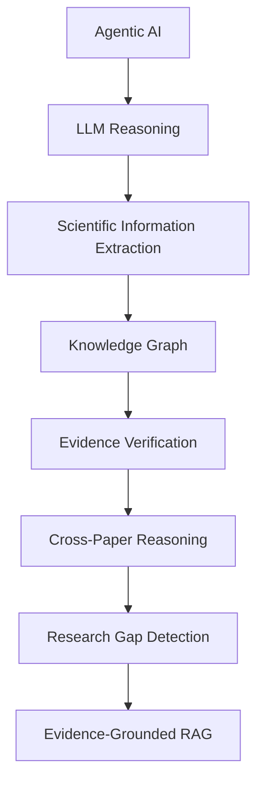

---

# Storage Architecture

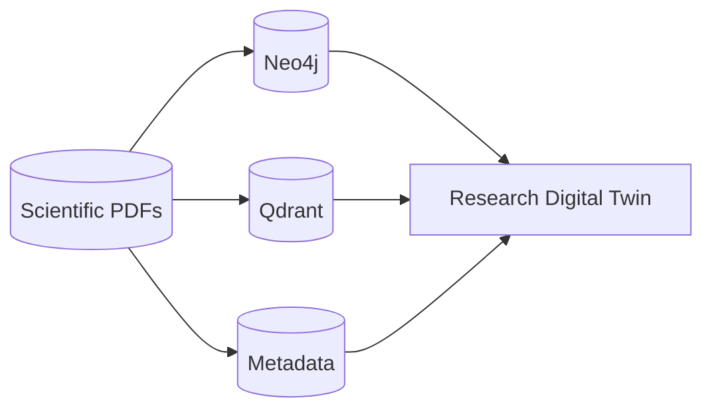

---

# Research Digital Twin Lifecycle

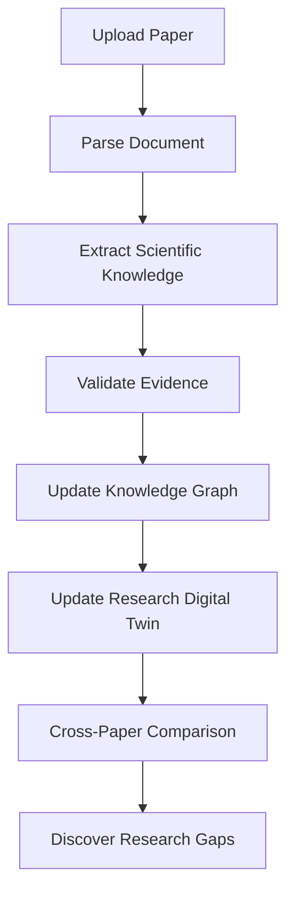

---

# Research Intelligence Pipeline

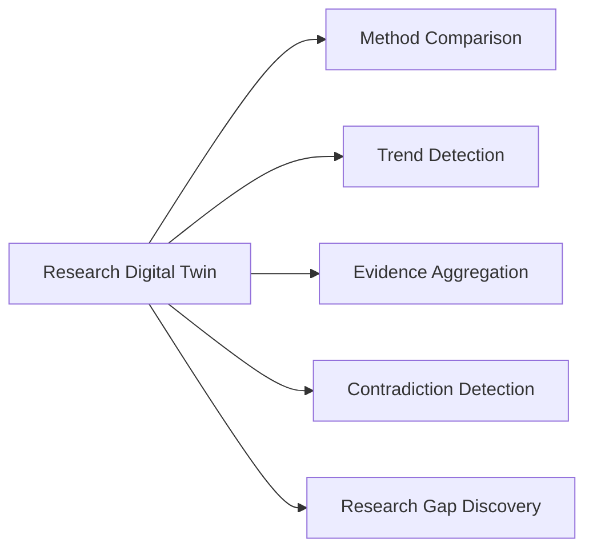

---

# Burhan Technology Stack

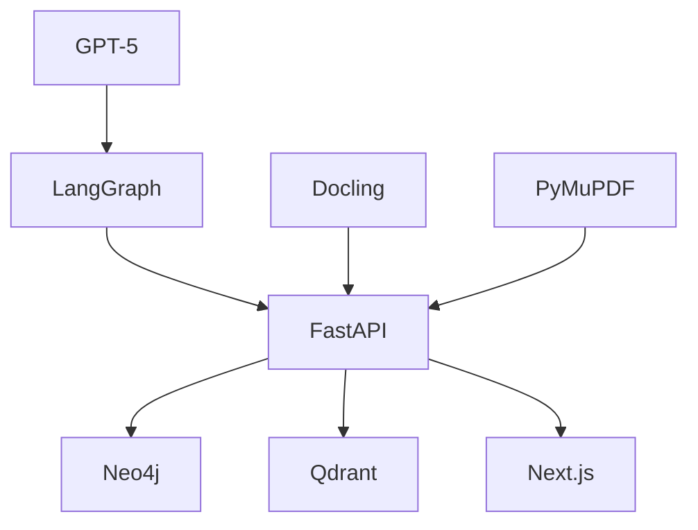

---

# Traditional RAG vs Burhan

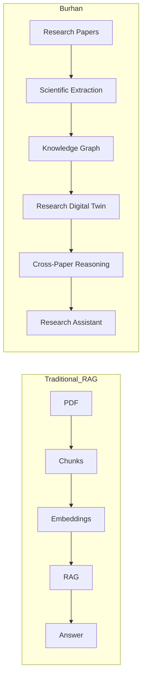

---

# Burhan's Innovation

Burhan is **not another Chat-with-PDF system**.

Its core innovation is the **Research Digital Twin**, a continuously evolving scientific intelligence layer that:

- models scientific entities
- stores explicit relationships
- validates evidence
- reasons across multiple papers
- discovers contradictions
- identifies recurring limitations
- detects research gaps
- powers evidence-grounded scientific assistance

The Retrieval-Augmented Generation (RAG) subsystem consumes the Digital Twin rather than replacing it.
