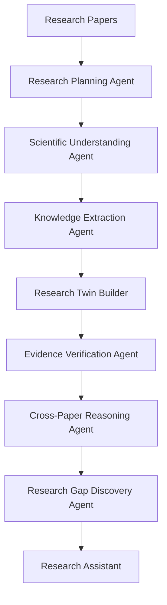
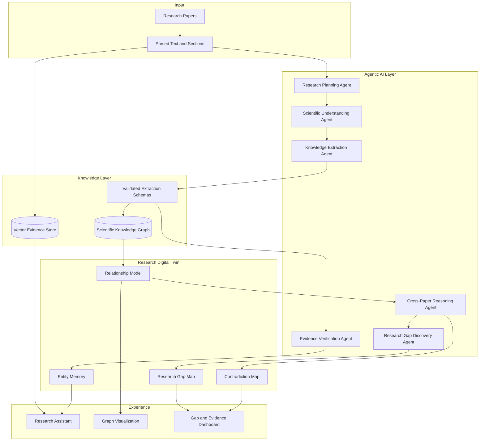
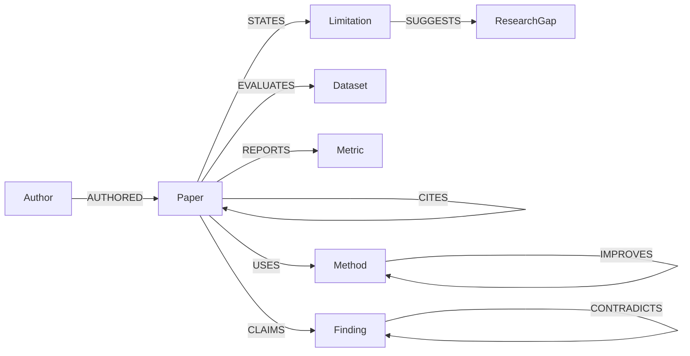
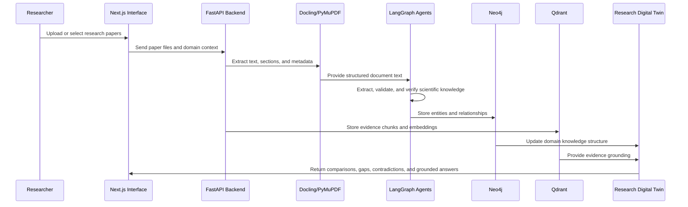

# Architecture

## Overview

Burhan is an Agentic AI Research Scientist that builds a living Research Digital Twin from research papers. The architecture is organized around a grounded multi-agent pipeline.

## Layered System

## Agent Responsibilities

| Agent | Responsibility | Output |
|---|---|---|
| Research Planning Agent | Defines the research scope and extraction priorities | Domain plan and extraction objectives |
| Scientific Understanding Agent | Interprets paper structure, sections, and scientific context | Section-aware paper representation |
| Knowledge Extraction Agent | Extracts scientific entities and relationships | Structured JSON validated by schema |
| Research Twin Builder | Merges extracted knowledge into the twin | Updated entities and graph relationships |
| Evidence Verification Agent | Checks that claims are grounded in source passages | Verified or flagged claims |
| Cross-Paper Reasoning Agent | Compares knowledge across papers | Comparisons, contradictions, and trends |
| Research Gap Discovery Agent | Converts limitations and missing links into candidate gaps | Evidence-backed research gaps |
| Research Assistant | Presents answers and explanations | Grounded research responses |

## Scientific Knowledge Graph Schema

Required node types:

- Paper
- Method
- Dataset
- Metric
- Finding
- Limitation
- Research Gap
- Author

Required relationship types:

- USES
- EVALUATES
- COMPARES
- CITES
- IMPROVES
- CONTRADICTS
- SUGGESTS

## Data Flow

## RAG Boundary

RAG grounds the Research Assistant with evidence passages. It is not the main architecture. The primary intelligence layer is the Research Digital Twin, supported by the Scientific Knowledge Graph and cross-paper reasoning.

## Implementation Boundary

This documentation describes the intended architecture and recommended implementation direction. The current repository remains a prototype and should evolve incrementally without overclaiming finished capabilities.
