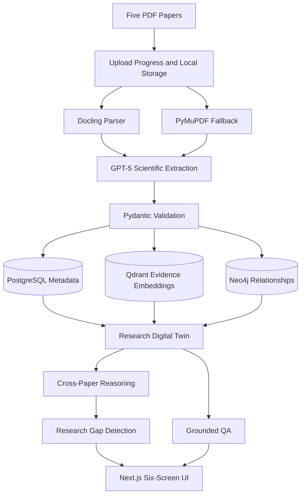

# Burhan MVP Architecture

Burhan is an Agentic AI Research Scientist. This MVP implements one complete workflow for the FARQ Hackathon: upload five papers, extract scientific knowledge, build a graph-backed Research Digital Twin, reason across papers, detect one evidence-backed gap, and answer one grounded question.

## Implemented Scope

- Upload exactly five PDF papers.
- Store PDFs locally under `storage/uploads/{run_id}`.
- Parse PDFs with Docling when available and PyMuPDF as fallback.
- Extract Title, Authors, Year, Abstract, and Sections.
- Extract Problem, Objective, Method, Dataset, Metrics, Findings, Limitations, and Future Work.
- Validate all extracted scientific knowledge with Pydantic models.
- Persist metadata to PostgreSQL.
- Persist evidence embeddings to Qdrant.
- Persist graph relationships to Neo4j.
- Build a Research Digital Twin artifact under `storage/runs/{run_id}.json`.
- Visualize the graph with React Flow.
- Produce cross-paper analysis, one evidence-backed research gap, and grounded QA.

## Agentic Workflow

```mermaid
flowchart LR
    A[Research Papers]
    B[Research Planning]
    C[Scientific Understanding]
    D[Knowledge Extraction]
    E[Research Twin Builder]
    F[Evidence Verification]
    G[Cross-Paper Reasoning]
    H[Gap Discovery]
    I[Research Assistant]

    A --> B --> C --> D --> E --> F --> G --> H --> I
```

The current proof of concept implements this workflow as a deterministic backend pipeline. LangGraph is documented as the intended orchestration framework for the next iteration, where each stage can become an explicit graph node with retries and human review hooks.
