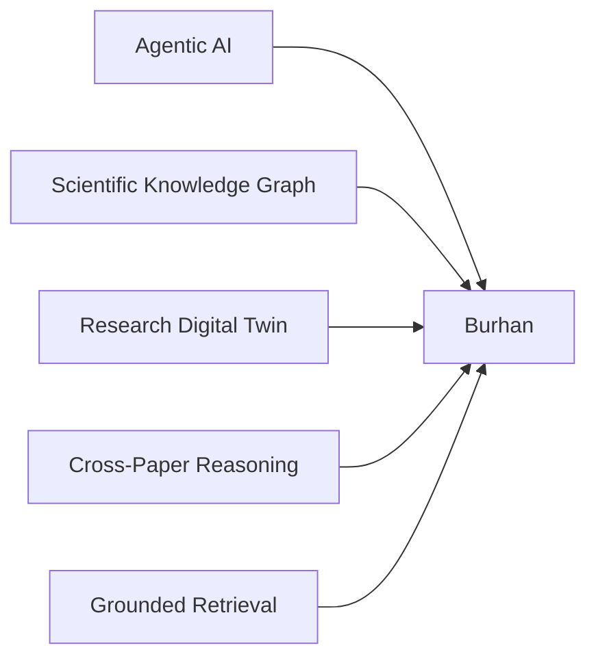

# Competitive Analysis

## Positioning

Burhan is an Agentic AI Research Scientist that builds and continuously evolves a Research Digital Twin. The competitive distinction is not that Burhan replaces existing research tools. It addresses a different layer: Scientific Knowledge Intelligence.

Existing systems often optimize individual research tasks. Burhan focuses on building structured scientific understanding across papers.

## Market Landscape

| Tool | Primary strength | Typical focus | Burhan's differentiation |
|---|---|---|---|
| Elicit | Literature review workflows and evidence extraction | Finding and summarizing relevant papers | Burhan builds an evolving Research Digital Twin with graph-based cross-paper intelligence |
| Consensus | Evidence-oriented answers from research papers | Research question answering | Burhan structures methods, datasets, metrics, findings, limitations, and gaps into a reusable knowledge layer |
| Connected Papers | Visual paper discovery | Citation and related-paper exploration | Burhan models scientific concepts and claims, not only paper proximity |
| ResearchRabbit | Literature discovery and collections | Paper recommendations and network exploration | Burhan focuses on extracted scientific knowledge and reasoning over a domain |
| SciSpace | Paper reading and explanation | Paper understanding and PDF assistance | Burhan moves beyond single-paper comprehension into field-level intelligence |
| Semantic Scholar | Scholarly search and metadata | Search, citations, and paper metadata | Burhan turns selected literature into a Research Digital Twin for reasoning |
| Litmaps | Literature mapping | Citation network mapping | Burhan adds structured scientific entities, evidence verification, and research gap discovery |
| scite | Citation context and claim support | How papers cite each other | Burhan uses citation and evidence signals inside a broader knowledge graph and twin |

## Gap Analysis

Existing tools are valuable, but they tend to center on one of four workflows:

- literature search;
- paper understanding;
- citation graph exploration;
- evidence synthesis.

Burhan centers on Scientific Knowledge Intelligence:

- extracting structured scientific entities;
- connecting findings, limitations, methods, datasets, and metrics;
- identifying contradictions across papers;
- detecting research gaps from evidence;
- updating the Research Digital Twin as new papers are added.

## Technical Differentiation

Burhan does not claim to invent a new model. The innovation is architectural:

The combination allows Burhan to reason over structured scientific knowledge rather than only retrieved passages.

## Positive Differentiation

Burhan is:

- a research scientist agent that plans, extracts, verifies, and reasons;
- a living Research Digital Twin that evolves with new papers;
- a Scientific Knowledge Graph that represents relationships explicitly;
- a cross-paper intelligence system for methods, datasets, findings, contradictions, and gaps;
- an evidence-grounded assistant supported by RAG.

## Scope Boundary

For the FARQ prototype, Burhan should not try to match the full scale of established scholarly search engines. The strongest scope is a focused research domain where the system demonstrates depth: structured extraction, graph construction, evidence verification, and gap discovery.
