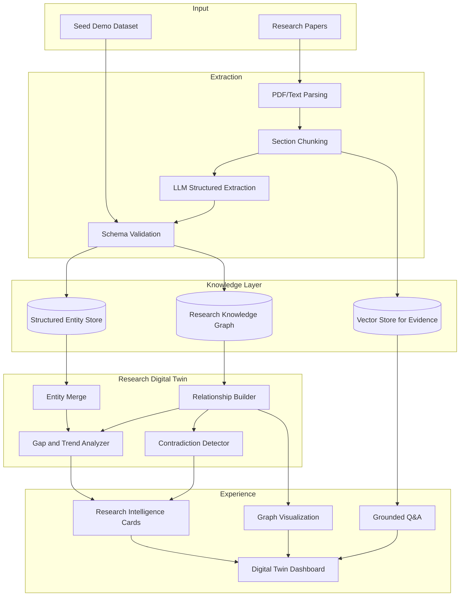
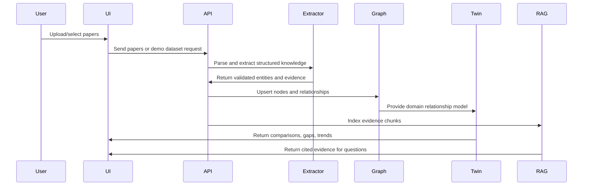
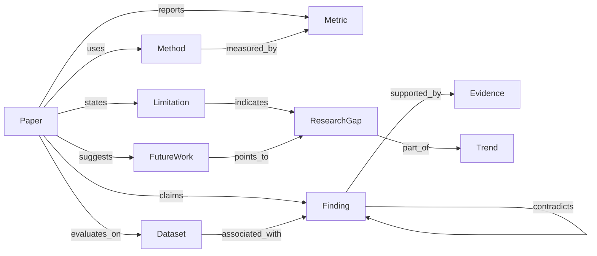

# Burhan FARQ Hackathon Execution Handbook

Version: 2026-09-23  
Team: Five AI students  
Project: Burhan, an evidence-driven Research Digital Twin  
Primary sources: `FARQ_Evaluation_Criteria-4.pdf`, `FARQ_Agenda_EN.pdf`

---

## Source Hierarchy and Official Constraints

This handbook is governed by the official FARQ documents in this order:

1. `FARQ_Evaluation_Criteria-4.pdf`
2. `FARQ_Agenda_EN.pdf`
3. Existing Burhan documentation, especially `README.md`
4. Official technical documentation only when implementation clarification is needed

Official preliminary-stage facts from the FARQ Evaluation Criteria:

| Official item | Requirement |
|---|---|
| Phase | Preliminary Development Phase |
| Dates | 27-28 September 2026 |
| Format | 2-minute video |
| Principle | Teams are evaluated on evidence of development and readiness to continue, not on having a finished product |

Official scoring model:

| Code | Criterion | Weight | FARQ subcriteria |
|---|---|---:|---|
| `IE` | Idea & Evolution | 41% | Development Progress; Problem & Solution Refinement; Target User & Need Validation; Uniqueness & Differentiation |
| `SP` | Solution & Prototype | 27% | Solution Design & Working Logic; Early Prototype / Proof of Concept |
| `FE` | Feasibility & Execution | 17% | Technical & Practical Feasibility; Implementation Plan & Next Steps |
| `IS` | Impact & Sustainability | 10% | Potential Impact & Value; Scalability & Sustainability |
| `PR` | Presentation | 5% | 2-Minute Video |

Decision rule for every feature, deliverable, and demo moment:

> Does this strengthen the Research Digital Twin?

If the answer is no, the item is removed from the preliminary scope or moved to Future Work.

---

## 1. Executive Summary

### Mission

Burhan transforms research papers into a living, structured, evidence-backed Research Digital Twin so researchers can understand what a research field collectively knows.

### Vision

Research knowledge is scattered across papers. Researchers must manually compare methods, datasets, metrics, findings, limitations, contradictions, and future work. Burhan converts those papers into a continuously updateable representation of the field.

The product vision:


### Core Differentiation

Burhan is not a Chat with PDFs product. RAG is only one subsystem used for evidence retrieval and grounded answer support. The core innovation is the Research Digital Twin: a structured, evolving model of papers, methods, datasets, metrics, findings, evidence, limitations, future work, relationships, contradictions, trends, and research gaps.

| Ordinary PDF chatbot | Burhan Research Digital Twin | FARQ value |
|---|---|---|
| Retrieves text passages | Extracts scientific entities and relationships | `IE`, `SP` |
| Answers from isolated documents | Models a research domain across papers | `IE`, `IS` |
| Uses RAG as the product | Uses RAG as evidence support inside a larger twin | `IE`, `SP` |
| Produces conversational answers | Produces comparisons, gaps, contradictions, and evidence maps | `IE`, `SP`, `IS` |
| Static per session | Updates as new papers are added | `IE`, `FE`, `IS` |

### Preliminary Submission Goal

By 27-28 September 2026, the team must submit a 2-minute video showing clear evidence of development and readiness to continue. The video must prove:

- The idea evolved beyond a document chatbot. `IE`
- The target user and need are clear. `IE`, `IS`
- The working logic is understandable. `SP`
- A proof of concept exists through screens, mockups, code, or demo. `SP`
- The plan to continue before the Grand Final is realistic. `FE`
- The presentation is concise and judge-ready. `PR`

---

## 2. Strategy to Maximize FARQ Evaluation Score

### Score Allocation Strategy

| Criterion | Weight | Team effort allocation | Main evidence |
|---|---:|---:|---|
| `IE` Idea & Evolution | 41% | 45% | Evolution log, user need evidence, differentiation, refined problem/solution |
| `SP` Solution & Prototype | 27% | 30% | Demo screens, extraction proof, graph visualization, Digital Twin workflow |
| `FE` Feasibility & Execution | 17% | 15% | Architecture, sprint plan, realistic next steps, risk register |
| `IS` Impact & Sustainability | 10% | 7% | Impact hypothesis, target users, scalability path |
| `PR` Presentation | 5% | 3% | Polished 2-minute video |

### 2.1 `IE` Idea & Evolution, 41%

| Field | Strategy |
|---|---|
| Objectives | Show tangible progress since idea screening; prove the problem and solution were refined; validate real target users; make uniqueness unmistakable. |
| Evidence required | Idea Evolution Log, before/after problem statement, user interview notes, competitor comparison, Digital Twin ontology v1, refined MVP scope. |
| Deliverables | Product brief, user validation summary, differentiation matrix, Research Digital Twin schema, demo narrative. |
| Common mistakes | Presenting Burhan as generic AI chat; claiming innovation without showing structure; skipping user need evidence; showing too many features without evolution. |
| Judge expectations | Clear problem, specific users, credible refinement, visible uniqueness, proof the team learned and improved. |
| Risk mitigation | Lead with Digital Twin workflow; show extracted entities before chat; include dated decisions; attach evidence to every claim. |

Actions:

- Maintain a daily `Idea Evolution Log`.
- Document why each feature exists and which FARQ criterion it supports.
- Interview or survey at least 3 target users: AI students, graduate researchers, literature-review teams, or research assistants.
- Show "before Burhan" vs "after Burhan" using the same research question.
- State repeatedly: "RAG supports evidence retrieval; the Digital Twin is the product."

### 2.2 `SP` Solution & Prototype, 27%

| Field | Strategy |
|---|---|
| Objectives | Demonstrate solution design, working logic, and early proof of concept through screens, mockups, code, or a demo. |
| Evidence required | Upload flow, extraction examples, graph view, gap detection card, grounded answer screen, prototype recording. |
| Deliverables | Prototype screens, architecture diagram, extraction JSON, graph visualization, demo video clips. |
| Common mistakes | Showing only a slide concept; over-relying on chat UI; failing to explain data flow; demoing unstable live extraction. |
| Judge expectations | They should understand how papers become structured intelligence and see enough proof that the concept works. |
| Risk mitigation | Use cached demo data; show deterministic screens; record the best flow; prepare screenshots as backup. |

Prototype target:

- 5-8 research papers in one demo domain for preliminary submission.
- At least 3 papers fully extracted into structured entities.
- At least 1 graph visualization.
- At least 2 research intelligence outputs:
  - Method/dataset/metric comparison.
  - Limitation-to-gap aggregation.
- At least 1 grounded answer that cites evidence.

### 2.3 `FE` Feasibility & Execution, 17%

| Field | Strategy |
|---|---|
| Objectives | Prove the project is realistic to continue building and has clear next steps before the Grand Final. |
| Evidence required | Architecture, sprint plan, owner matrix, dependencies, risk register, next-step roadmap. |
| Deliverables | Technical architecture, day-by-day schedule, deliverables tracker, QA plan, final readiness checklist. |
| Common mistakes | Proposing a system too large for the team; vague next steps; unclear ownership; no fallback plan. |
| Judge expectations | A credible team with a practical plan, scoped MVP, and awareness of technical risk. |
| Risk mitigation | Prioritize a polished MVP; defer non-Digital-Twin features; assign single owners; rehearse daily. |

Feasibility boundaries:

- One research domain for the preliminary video.
- One primary extraction schema.
- One graph representation.
- One polished demo flow.
- No autonomous agent complexity unless it directly strengthens the Digital Twin story.

### 2.4 `IS` Impact & Sustainability, 10%

| Field | Strategy |
|---|---|
| Objectives | Show meaningful value for target users and a credible path to wider use. |
| Evidence required | User pain points, impact metrics, use cases, scalability roadmap, responsible AI notes. |
| Deliverables | Impact statement, target user map, post-hackathon roadmap, sustainability plan. |
| Common mistakes | Saying "helps researchers" without measurable value; ignoring trust and citation risk; no scale path. |
| Judge expectations | Clear beneficiaries, measurable improvement, and potential for long-term use. |
| Risk mitigation | Focus on literature review acceleration, evidence traceability, and domain expansion after MVP. |

Impact hypothesis:

- Target users waste time comparing papers manually.
- Burhan reduces discovery time by structuring scientific evidence.
- Burhan improves research planning by surfacing limitations, contradictions, trends, and gaps.

### 2.5 `PR` Presentation, 5%

| Field | Strategy |
|---|---|
| Objectives | Deliver a clear 2-minute video showing progress, solution, evidence, and next steps. |
| Evidence required | Script, storyboard, screen recordings, captions, final export under 2 minutes. |
| Deliverables | 2-minute video, backup video, thumbnail, submission-ready description. |
| Common mistakes | Spending too much time on team intro; showing a chat screen first; unclear next steps; exceeding time. |
| Judge expectations | A concise story with visible progress and readiness to continue. |
| Risk mitigation | Use a strict storyboard; show graph before chat; rehearse narration; keep backup export. |

---

## 3. Official Agenda Integration and Workshop Preparation

The official FARQ agenda covers pre-hackathon sessions and workshops from 20-26 September 2026. Since today is 23 September 2026, sessions from 20-22 September should be recovered through recordings, notes, or team summaries if available. Sessions on 25-26 September should be attended live through the official Teams link.

### Workshop-to-Deliverable Map

| Date | Workshop | Learning objective | Team member(s) | Expected deliverable | Project improvement | FARQ criteria |
|---|---|---|---|---|---|---|
| 20 Sep, 5-6 PM | Opening Session | Understand hackathon framing, expectations, logistics | Member 1, Member 4 | Official rules and logistics notes | Prevents submission/process mistakes | `FE`, `PR` |
| 20 Sep, 6-7 PM | Tips to Win a Hackathon: from Student Perspective | Learn practical judging and team execution habits | Member 1, Member 5 | Hackathon execution checklist | Improves focus, demo discipline, and team rhythm | `FE`, `PR` |
| 21 Sep, 5-6 PM | The Age of Vibe Coding | Learn rapid prototyping patterns and AI-assisted build flow | Member 4, Member 5 | Prototype speed plan | Faster proof of concept without overengineering | `SP`, `FE` |
| 21 Sep, 6-7 PM | The Importance of Data in AI | Understand data quality and AI output reliability | Member 2, Member 3 | Demo dataset and extraction QA rubric | Strengthens extraction evidence and trust | `SP`, `IS` |
| 22 Sep, 5-6 PM | Build the Right Thing: How to Evaluate Your Product Idea Before You Build It | Validate product idea before implementation | Member 1, Member 3 | Refined problem/solution memo | Improves target user validation and problem refinement | `IE`, `IS` |
| 22 Sep, 6-7 PM | Threat Modeling: From System Analysis to Risk Assessment & Mitigation | Identify technical, privacy, and reliability risks | Member 4, Member 2 | Risk register update | Makes feasibility and responsible AI stronger | `FE`, `IS` |
| 23-24 Sep | Saudi National Day Holiday | Use as focused asynchronous build and preparation time | All | Extraction schema, paper set, video outline | Converts holiday time into execution progress | `IE`, `SP`, `FE` |
| 25 Sep, 5-6 PM | The Idea Behind Agentic AI | Understand agentic patterns and decide what belongs in scope | Member 2, Member 3 | Agentic AI scope decision | Prevents distracting agent features unless they strengthen the twin | `IE`, `FE` |
| 25 Sep, 6-7 PM | How to Start Building Your Website? | Learn fast website/prototype presentation | Member 5, Member 4 | UI implementation checklist | Improves prototype clarity and judge-facing polish | `SP`, `PR` |
| 26 Sep, 5-6 PM | How to Convince a Jury: from Entrepreneur Perspective | Learn persuasive pitch structure | Member 1, Member 5 | Final video/pitch script revisions | Improves judge comprehension and confidence | `IE`, `PR` |
| 26 Sep, 6-7 PM | From Idea to Prototype | Learn how to convert concept into proof of concept | All | Final prototype readiness plan | Directly supports preliminary video evidence | `SP`, `FE`, `PR` |

### Workshop Action Protocol

For every workshop:

1. One primary attendee takes notes.
2. One secondary attendee captures questions and links.
3. Within one hour, the attendee writes:
   - Three lessons.
   - Two changes to Burhan.
   - One risk to avoid.
   - One artifact to update.
4. Product Lead maps changes to FARQ criteria before implementation.

---

## 4. Product Scope and Digital Twin Protection

### Research Digital Twin Definition

Burhan's Digital Twin is the structured, updateable model of a research domain. It represents:

- Papers.
- Methods.
- Datasets.
- Metrics.
- Findings.
- Evidence.
- Limitations.
- Future work.
- Relationships.
- Contradictions.
- Trends.
- Research gaps.

### Feature Gate

| Feature candidate | Does it strengthen the Research Digital Twin? | Preliminary decision | FARQ criteria |
|---|---|---|---|
| Paper upload / selection | Yes, starts twin creation | Must Have | `SP` |
| Structured extraction | Yes, converts papers into entities | Must Have | `IE`, `SP` |
| Knowledge graph | Yes, represents relationships | Must Have | `IE`, `SP` |
| Digital Twin dashboard | Yes, makes the model visible | Must Have | `SP`, `PR` |
| Method/dataset/metric comparison | Yes, proves cross-paper intelligence | Must Have | `IE`, `SP`, `IS` |
| Limitation-to-gap detection | Yes, demonstrates research intelligence | Must Have | `IE`, `IS` |
| Grounded Q&A | Yes, only when evidence-backed and twin-aware | Should Have | `SP`, `IS` |
| Generic PDF chat | No, weakens differentiation | Remove from preliminary scope | None |
| User accounts | No for preliminary proof | Future Work | `IS` later |
| Multi-domain support | Yes but too broad now | Future Work | `IS` later |
| Agentic autonomous research assistant | Only if twin-directed | Future Work unless workshop proves value | `IE`, `FE` later |
| Exportable literature review report | Yes, but not required for preliminary | Could Have | `IS`, `SP` |

### MVP Definition

| Priority | Scope | Reason | Criteria |
|---|---|---|---|
| Must Have | Demo paper set, extraction schema, cached extraction examples, graph visualization, Digital Twin dashboard, gap cards, 2-minute video | Required to prove the concept within preliminary-stage expectations | `IE`, `SP`, `PR` |
| Should Have | Grounded question answering, confidence indicators, extraction QA table, user validation quotes | Strengthens trust and impact if core is stable | `SP`, `IS`, `FE` |
| Could Have | Exported insight report, trend timeline, contradiction examples | Differentiates further but may risk time | `IE`, `IS` |
| Future Work | Multi-domain monitoring, academic database integration, collaborative annotations, human review workflows | Valuable after preliminary proof | `IS`, `FE` |

---

## 5. Technical Architecture Plan

### End-to-End Architecture



### Working Logic



### Knowledge Graph Model



### Data Schema, Preliminary MVP

```json
{
  "paper": {
    "title": "string",
    "authors": ["string"],
    "year": 2026,
    "domain": "string"
  },
  "methods": [{"name": "string", "description": "string"}],
  "datasets": [{"name": "string", "description": "string"}],
  "metrics": [{"name": "string", "value": "string", "context": "string"}],
  "findings": [{"claim": "string", "evidence_text": "string", "section": "string"}],
  "limitations": [{"description": "string", "evidence_text": "string"}],
  "future_work": [{"description": "string"}],
  "relationships": [
    {"source": "string", "type": "uses|reports|supports|contradicts|indicates_gap", "target": "string"}
  ]
}
```

### Component Decisions

| Component | Preliminary approach | Why feasible | Criteria |
|---|---|---|---|
| PDF parsing | Use uploaded papers or pre-parsed demo text | Reduces demo risk | `SP`, `FE` |
| Extraction | LLM prompt with strict JSON schema and cached outputs | Shows working logic without requiring perfect automation | `SP`, `FE` |
| Knowledge graph | Neo4j if ready; otherwise graph JSON rendered in UI | Keeps prototype realistic | `SP`, `FE` |
| Vector evidence | Lightweight embeddings or cached evidence mapping | Supports grounded Q&A as subsystem | `SP` |
| Frontend | Dashboard-first, not chat-first | Protects differentiation | `IE`, `PR` |
| Gap detection | Rule-based aggregation over limitations and future work | Explainable and feasible | `IE`, `SP`, `IS` |

---

## 6. Team Execution Plan

### Responsibility Matrix

| Member | Owner role | Primary responsibilities | Secondary responsibilities | Weekly deliverables | Review checkpoints | Dependencies |
|---|---|---|---|---|---|---|
| Member 1 | Product, Evaluation, Video Lead | FARQ criteria alignment, problem refinement, user validation, video script, presentation story | Workshop notes, impact statement | Product brief, evolution log, user validation summary, storyboard | Daily scoring review; final video review | Input from all members |
| Member 2 | AI Extraction and Evidence Lead | Extraction prompt, schema examples, evidence mapping, citation validation | RAG evidence support, QA rubric | Extraction JSON, prompt versions, citation QA table | Daily extraction review | Demo paper set, schema |
| Member 3 | Knowledge Graph and Research Intelligence Lead | Ontology, graph model, gap logic, trend/contradiction examples | Workshop learning on agentic AI | Graph schema, gap examples, insight definitions | Daily graph review | Extraction outputs |
| Member 4 | Backend, Integration, Feasibility Lead | APIs, storage, pipeline orchestration, setup/deployment, risk register | Threat modeling, technical documentation | Backend flow, architecture diagram, setup notes | Integration check twice daily | Schema, UI needs |
| Member 5 | Frontend, Demo, Prototype Lead | Dashboard, visualization, demo flow, screen recordings, visual polish | Website workshop notes, backup recording | Prototype screens, graph UI, demo clips | Daily demo run | Backend/API or mock data |

### RACI Snapshot

| Deliverable | Responsible | Accountable | Consulted | Informed | Criteria |
|---|---|---|---|---|---|
| Product brief | Member 1 | Member 1 | All | All | `IE` |
| Demo paper set | Member 2 | Member 1 | Member 3 | All | `IE`, `SP` |
| Extraction schema | Member 2 | Member 3 | Member 4 | All | `SP`, `FE` |
| Knowledge graph | Member 3 | Member 3 | Member 2, 5 | All | `IE`, `SP` |
| Backend integration | Member 4 | Member 4 | Member 2, 5 | All | `SP`, `FE` |
| Frontend dashboard | Member 5 | Member 5 | Member 1, 3, 4 | All | `SP`, `PR` |
| User validation | Member 1 | Member 1 | All | All | `IE`, `IS` |
| 2-minute video | Member 1, 5 | Member 1 | All | All | `PR`, all |
| Risk register | Member 4 | Member 4 | All | All | `FE` |
| Final submission checklist | Member 1 | Member 1 | All | All | all |

---

## 7. Sprint Planning

### Sprint 0: Official Alignment and Recovery, 23 September

| Field | Details |
|---|---|
| Objectives | Align on official criteria, recover missed agenda lessons, freeze Digital Twin scope. |
| Tasks | Review criteria; summarize 20-22 Sep sessions if recordings/notes exist; choose demo domain; assign roles; create evidence folder. |
| Owners | Member 1 leads; all contribute. |
| Dependencies | Official PDFs, README, team availability. |
| Definition of Done | Everyone knows scoring model; one demo domain selected; Digital Twin feature gate accepted. |
| Deliverables | Criteria map, role matrix, paper search list, evidence folder. |
| Demo milestone | Paper-to-twin story is explainable without software. |
| Criteria | `IE`, `FE`, `PR` |

### Sprint 1: Data and Schema, 24 September

| Field | Details |
|---|---|
| Objectives | Build the research knowledge foundation. |
| Tasks | Select 5-8 papers; define extraction schema; manually extract one paper; design graph nodes/edges; draft video storyboard. |
| Owners | Member 2 and Member 3 lead; Member 1 validates story. |
| Dependencies | Demo domain, accessible papers. |
| Definition of Done | One paper has complete structured extraction; graph model supports required entities. |
| Deliverables | Paper list, schema v1, sample extraction, graph model, storyboard v1. |
| Demo milestone | Show one paper becoming structured entities. |
| Criteria | `IE`, `SP`, `FE` |

### Sprint 2: Prototype Assembly, 25 September

| Field | Details |
|---|---|
| Objectives | Create visible proof of concept. |
| Tasks | Implement or mock upload/select flow; produce cached extractions; build dashboard skeleton; render graph; attend Agentic AI and Website workshops. |
| Owners | Member 4 and Member 5 lead; Member 2 provides data. |
| Dependencies | Schema v1, cached extraction examples. |
| Definition of Done | Dashboard can show extracted paper data and graph view. |
| Deliverables | Prototype screen v1, graph visualization v1, workshop action notes. |
| Demo milestone | Show structured entities connected in a graph. |
| Criteria | `SP`, `FE`, `PR` |

### Sprint 3: Research Intelligence and Jury Story, 26 September

| Field | Details |
|---|---|
| Objectives | Add score-winning insights and finalize the video story. |
| Tasks | Build gap detection examples; build method/dataset comparison; add grounded answer view; attend Jury and Prototype workshops; revise script. |
| Owners | Member 3 and Member 1 lead; Member 5 records clips. |
| Dependencies | Graph data, UI screens, workshop learning. |
| Definition of Done | Demo shows gap detection and grounded answer; video script is locked. |
| Deliverables | Gap cards, comparison table, cited answer screen, script v2, demo clips. |
| Demo milestone | Full flow works from papers to Digital Twin to insight. |
| Criteria | `IE`, `SP`, `IS`, `PR` |

### Sprint 4: Preliminary Submission, 27 September

| Field | Details |
|---|---|
| Objectives | Produce and review submission materials for the official 27-28 Sep preliminary phase. |
| Tasks | Record final clips; edit 2-minute video; run QA checklist; update README; capture screenshots; prepare backup. |
| Owners | Member 1 and Member 5 lead; all review. |
| Dependencies | Stable prototype, final script. |
| Definition of Done | Video is under 2 minutes and covers progress, solution, evidence, and next steps. |
| Deliverables | Final video candidate, README update, screenshots, QA checklist. |
| Demo milestone | Submission-ready video draft. |
| Criteria | all, especially `PR` |

### Sprint 5: Buffer and Submission, 28 September

| Field | Details |
|---|---|
| Objectives | Submit confidently with zero missing artifacts. |
| Tasks | Final watch-through; confirm portal requirements; submit; archive artifacts; document next steps before Grand Final. |
| Owners | Member 1 accountable; Member 4 verifies repo; Member 5 verifies video file. |
| Dependencies | Official submission instructions. |
| Definition of Done | Submission completed and confirmation saved. |
| Deliverables | Submitted 2-minute video, artifact archive, post-preliminary roadmap. |
| Demo milestone | Preliminary submission complete. |
| Criteria | `FE`, `PR` |

---

## 8. Detailed Day-by-Day Schedule Until Preliminary Submission

| Date | Objectives | Tasks | Owners | Outputs | Risks | Dependencies | Success criteria |
|---|---|---|---|---|---|---|---|
| 23 Sep | Align and scope | Read official PDFs; freeze Digital Twin scope; assign roles; recover notes from 20-22 Sep workshops; identify target users | Member 1 leads; all | Criteria map, role matrix, interview list | Lost time from rework | PDFs, team sync | Every member can explain scoring and differentiation |
| 24 Sep | Build knowledge foundation | Select papers; create schema; manually extract one paper; design graph; draft storyboard | Members 2, 3, 1 | Paper set, schema v1, sample extraction, graph model | Papers too broad; schema too complex | Demo domain | One complete extraction and graph model exist |
| 25 Sep | Prototype visible workflow | Build dashboard skeleton; render graph; create cached data; attend Agentic AI and Website workshops; update scope after workshops | Members 4, 5, 2 | Prototype v1, graph v1, workshop notes | UI not ready; feature creep from agentic ideas | Schema, cached data | Papers-to-graph flow visible |
| 26 Sep | Add intelligence and persuasion | Gap detection; method comparison; grounded Q&A; attend Jury and Prototype workshops; lock video script | Members 3, 1, 5 | Insight cards, cited answer, script v2, clips | Weak story; unstable demo | Graph data, UI | Full demo path recorded |
| 27 Sep | Produce preliminary package | Record final video; edit; update README; run QA; make backup | Members 1, 5, 4 | Final video candidate, screenshots, README, QA report | Video over 2 minutes; missing evidence | Stable prototype | Video clearly shows progress, solution, evidence, next steps |
| 28 Sep | Submit and archive | Final review; submit; save confirmation; document next steps | Member 1 accountable; all | Submitted package, confirmation, next-step plan | Portal or file issue | Official submission instructions | Submission complete with backup artifacts saved |

---

## 9. Evidence Checklists by Evaluation Criterion

### `IE` Idea & Evolution, 41%

- [ ] Idea Evolution Log with dated changes.
- [ ] Problem statement before and after refinement.
- [ ] Target user definition.
- [ ] At least 3 user validation notes or survey responses.
- [ ] Competitor/differentiation matrix against PDF chat and generic RAG.
- [ ] Research Digital Twin ontology.
- [ ] MVP scope showing removed non-twin features.
- [ ] Screenshots showing extraction and graph before Q&A.

### `SP` Solution & Prototype, 27%

- [ ] Upload/select paper screen.
- [ ] Structured extraction example.
- [ ] Knowledge graph visualization.
- [ ] Digital Twin dashboard.
- [ ] Research gap example.
- [ ] Method/dataset/metric comparison.
- [ ] Grounded answer with evidence citation.
- [ ] Prototype recording.
- [ ] Architecture diagram.

### `FE` Feasibility & Execution, 17%

- [ ] Technical architecture.
- [ ] Day-by-day schedule.
- [ ] Sprint plan.
- [ ] Owner matrix.
- [ ] Risk register.
- [ ] Dependencies list.
- [ ] Next steps before Grand Final.
- [ ] Repository setup notes.
- [ ] Backup plan.

### `IS` Impact & Sustainability, 10%

- [ ] Target user pain points.
- [ ] Impact hypothesis.
- [ ] Time-saving or quality-improvement claim stated carefully.
- [ ] Scalability roadmap.
- [ ] Responsible AI and citation trust notes.
- [ ] Potential post-hackathon users: students, labs, literature review teams.
- [ ] Future work list.

### `PR` Presentation, 5%

- [ ] 2-minute video script.
- [ ] Storyboard.
- [ ] Screen recordings.
- [ ] Captions for key terms.
- [ ] Final export under 2 minutes.
- [ ] Backup video file.
- [ ] One-sentence explanation: "Burhan builds a living evidence model of a research field."

---

## 10. Demo Strategy

### Judge Understanding Goal

Within the first 20 seconds, judges should understand that Burhan is not another PDF chatbot. It builds a Research Digital Twin.

### Demo Flow


### Screen-by-Screen Demo Plan

| Step | Screen | What to say | What judges learn | Criteria |
|---|---|---|---|---|
| 1 | Research domain and paper set | "We start with a focused research domain and multiple papers." | Target scope is realistic | `IE`, `FE` |
| 2 | Upload/select papers | "These papers are inputs to a Digital Twin, not isolated chat files." | Product workflow begins | `SP` |
| 3 | Extraction preview | "Burhan extracts methods, datasets, metrics, findings, evidence, limitations, and future work." | Core difference from RAG | `IE`, `SP` |
| 4 | Knowledge graph | "The extracted knowledge becomes relationships across the field." | Digital Twin is visible | `IE`, `SP` |
| 5 | Research intelligence cards | "The twin identifies repeated limitations and turns them into research gaps." | Value beyond retrieval | `IE`, `IS` |
| 6 | Method comparison | "It compares methods and datasets across papers." | Cross-paper reasoning | `SP`, `IS` |
| 7 | Grounded Q&A | "RAG retrieves evidence, but the twin structures the answer." | RAG is a subsystem | `SP` |
| 8 | Add/update paper | "New papers update the twin." | Evolution and scalability | `IE`, `IS` |

### Required Demo Line

Use this exact line in the video:

> RAG is not the product. RAG is the evidence layer. The product is the Research Digital Twin.

### Backup Demo Strategy

| Failure | Backup |
|---|---|
| Upload fails | Use preloaded demo dataset |
| LLM extraction fails | Use cached validated extraction JSON |
| Graph rendering fails | Use screenshot or recorded clip |
| Internet/API fails | Run local static demo recording |
| Video export issue | Keep two exported versions and raw clips |

---

## 11. Two-Minute Video Plan

Official format from the evaluation criteria: 2-minute video.

### Storyboard

| Time | Scene | Visuals | Narration | Criteria |
|---:|---|---|---|---|
| 0:00-0:10 | Hook | Papers, highlighted fragments, messy comparison notes | "Researchers do not need another PDF chatbot. They need to understand what an entire field knows." | `IE`, `PR` |
| 0:10-0:25 | Problem | Manual method/dataset/limitation comparison | "Literature review requires comparing methods, datasets, metrics, findings, limitations, and gaps across many papers." | `IE`, `IS` |
| 0:25-0:40 | Burhan concept | Workflow diagram | "Burhan turns research papers into a living Research Digital Twin." | `IE` |
| 0:40-0:58 | Extraction proof | Structured extraction screen | "Each paper becomes structured scientific knowledge tied to evidence." | `SP` |
| 0:58-1:15 | Twin proof | Knowledge graph visualization | "Those entities connect into a graph that represents the research domain." | `SP`, `IE` |
| 1:15-1:32 | Intelligence | Gap cards and comparison table | "The twin surfaces repeated limitations, method comparisons, and research gaps." | `IE`, `IS` |
| 1:32-1:45 | Grounded answer | Answer with citations | "RAG is only the evidence layer; the Digital Twin guides the intelligence." | `SP` |
| 1:45-1:55 | Feasibility | Architecture and next steps | "Our next steps are to improve extraction quality, expand papers, and prepare for the Grand Final." | `FE` |
| 1:55-2:00 | Close | Burhan dashboard and team name | "Burhan turns scattered papers into evidence-driven research intelligence." | `PR` |

### Video Acceptance Criteria

- [ ] 120 seconds or less.
- [ ] Shows progress, solution, evidence, and next steps.
- [ ] Shows extraction before Q&A.
- [ ] Shows graph or Digital Twin dashboard.
- [ ] Uses captions for "Extract", "Connect", "Digital Twin", "Evidence", "Research Gap".
- [ ] Includes one clear statement that Burhan is not a PDF chatbot.

---

## 12. Deliverables Tracker

Status values: `Not Started`, `In Progress`, `Ready`, `Submitted`.

| Deliverable | Owner | Status | Priority | Deadline | Dependencies | Evaluation criterion supported |
|---|---|---|---|---|---|---|
| Official criteria map | Member 1 | In Progress | P0 | 23 Sep | Criteria PDF | `IE`, `FE`, `PR` |
| Agenda workshop action plan | Member 1 | In Progress | P0 | 23 Sep | Agenda PDF | `FE`, `PR` |
| Demo domain decision | Member 1 | Not Started | P0 | 23 Sep | Team agreement | `IE`, `FE` |
| Paper set, 5-8 papers | Member 2 | Not Started | P0 | 24 Sep | Demo domain | `IE`, `SP` |
| Extraction schema v1 | Member 2 | Not Started | P0 | 24 Sep | Paper set | `SP`, `FE` |
| Ontology and graph model | Member 3 | Not Started | P0 | 24 Sep | Schema | `IE`, `SP` |
| Sample extraction JSON | Member 2 | Not Started | P0 | 24 Sep | Schema, paper | `SP` |
| Prototype dashboard | Member 5 | Not Started | P0 | 25 Sep | Mock/API data | `SP`, `PR` |
| Knowledge graph visualization | Member 5 | Not Started | P0 | 25 Sep | Graph model | `IE`, `SP` |
| Gap detection example | Member 3 | Not Started | P0 | 26 Sep | Extracted limitations | `IE`, `IS` |
| Method comparison view | Member 3 | Not Started | P1 | 26 Sep | Extracted methods/metrics | `SP`, `IS` |
| Grounded answer screen | Member 2, 5 | Not Started | P1 | 26 Sep | Evidence chunks | `SP` |
| User validation notes | Member 1 | Not Started | P0 | 26 Sep | Target users | `IE`, `IS` |
| Risk register | Member 4 | Not Started | P0 | 26 Sep | Architecture | `FE` |
| README update | Member 4, 1 | Not Started | P1 | 27 Sep | Prototype details | `FE`, `PR` |
| Video script | Member 1 | Not Started | P0 | 26 Sep | Storyboard | `PR`, all |
| Screen recordings | Member 5 | Not Started | P0 | 27 Sep | Prototype | `SP`, `PR` |
| Final 2-minute video | Member 1, 5 | Not Started | P0 | 27 Sep | Clips, script | `PR`, all |
| Submission package | Member 1 | Not Started | P0 | 28 Sep | Final video | all |
| Next-steps roadmap | Member 4, 1 | Not Started | P1 | 28 Sep | Preliminary artifacts | `FE`, `IS` |

---

## 13. Risk Register

| Risk | Likelihood | Impact | Mitigation | Owner | Criteria at risk |
|---|---|---|---|---|---|
| Burhan appears to be Chat with PDFs | Medium | Very High | Show extraction and graph before any Q&A; use required demo line | Member 1 | `IE`, `SP` |
| Scope creep | High | High | Enforce Digital Twin feature gate | Member 1 | `FE`, `SP` |
| Extraction quality is weak | High | High | Use strict schema, manual QA, cached validated outputs | Member 2 | `SP` |
| Graph is unclear | Medium | High | Limit node types and use clear labels/colors | Member 3, 5 | `SP`, `PR` |
| Video exceeds 2 minutes | Medium | High | Script by timestamp; rehearse; cut intro | Member 1 | `PR` |
| Missing user validation | Medium | High | Run quick interviews by 26 Sep | Member 1 | `IE`, `IS` |
| Website/prototype not stable | Medium | High | Use preloaded dataset and screen recording | Member 5 | `SP`, `PR` |
| Backend integration delays | Medium | Medium | Mock frontend data first, integrate later | Member 4 | `FE`, `SP` |
| Workshop learning not applied | Medium | Medium | Require action notes after each session | Member 1 | `IE`, `FE` |
| Submission portal issue | Low | High | Submit early on 28 Sep; keep backup files | Member 1 | `PR`, `FE` |

---

## 14. Quality Assurance Plan

### Prototype QA

| Test | Owner | Pass condition | Criteria |
|---|---|---|---|
| Paper input test | Member 4 | Demo papers load or preloaded set appears | `SP` |
| Extraction schema test | Member 2 | Required entities exist and validate | `SP`, `FE` |
| Evidence citation test | Member 2 | Each displayed claim links to paper evidence | `SP`, `IS` |
| Graph visualization test | Member 3, 5 | Nodes and edges show meaningful relationships | `SP`, `PR` |
| Gap detection test | Member 3 | Gap comes from limitations/future work evidence | `IE`, `IS` |
| Demo rehearsal test | Member 5 | Full flow completes without confusion | `PR` |
| Video review test | Member 1 | Under 2 minutes; covers progress, solution, evidence, next steps | `PR`, all |

### Extraction Review Rubric

| Field | Score 2 | Score 1 | Score 0 |
|---|---|---|---|
| Method | Correct and evidence-backed | Partially correct | Missing or wrong |
| Dataset | Correct and evidence-backed | Incomplete | Missing or wrong |
| Metric | Correct value/context | Metric without context | Missing or wrong |
| Finding | Accurate claim with evidence | Vague claim | Unsupported |
| Limitation | Clear limitation with evidence | Vague limitation | Missing |
| Future work | Correct direction | Generic | Missing |

Target for preliminary video: average score of 1.5+ across showcased papers, with no unsupported claims shown in the video.

---

## 15. Post-Preliminary Roadmap Toward Grand Final

The official PDFs used here specify the preliminary development phase and pre-hackathon agenda. The Grand Final date must be confirmed from later official FARQ communications before assigning fixed dates.

| Phase | Objective | Deliverables | Criteria |
|---|---|---|---|
| After preliminary feedback | Incorporate judge/mentor feedback | Updated MVP, refined pitch, issue list | `IE`, `FE` |
| Prototype hardening | Move from proof of concept to stable demo | Robust extraction, better graph, deployed app | `SP`, `FE` |
| Evidence expansion | Increase credibility | 12-20 papers, QA report, user feedback | `IE`, `IS` |
| Product polish | Improve judge-facing experience | Cleaner UI, better visual hierarchy, demo script | `SP`, `PR` |
| Sustainability story | Show long-term value | Research lab workflow, scale plan, trust model | `IS` |

---

## 16. Final Readiness Checklist

### Technical

- [ ] Prototype opens on demo machine.
- [ ] Demo data loads without external dependency.
- [ ] Cached extraction fallback exists.
- [ ] Graph visualization works or backup clip is ready.
- [ ] Grounded answer screen has citations.
- [ ] No generic chat screen is shown as the first product experience.

### Research

- [ ] Demo domain is focused.
- [ ] Paper list is documented.
- [ ] Extraction examples are reviewed.
- [ ] Gap examples are evidence-backed.
- [ ] User validation notes are summarized.
- [ ] Claims are not exaggerated.

### Documentation

- [ ] README explains Burhan as a Research Digital Twin.
- [ ] Architecture diagram is current.
- [ ] Evaluation criteria mapping is included.
- [ ] Risk register is updated.
- [ ] Next steps before Grand Final are clear.
- [ ] Known limitations are honest.

### Prototype

- [ ] Upload/select flow is visible.
- [ ] Extraction preview is visible.
- [ ] Digital Twin graph is visible.
- [ ] Gap detection is visible.
- [ ] Method comparison is visible or documented as next.
- [ ] Grounded Q&A is framed as a subsystem.

### Video

- [ ] Final export is 2 minutes or less.
- [ ] Video shows progress, solution, evidence, and next steps.
- [ ] Video includes Digital Twin distinction.
- [ ] Video has readable captions.
- [ ] Audio is clear.
- [ ] Backup export exists.

### Presentation

- [ ] One-sentence pitch is memorized.
- [ ] Each team member knows their role.
- [ ] Q&A answers are prepared.
- [ ] Demo script is rehearsed.
- [ ] Timing is tested.

### Repository

- [ ] Important artifacts are committed or saved.
- [ ] README is updated.
- [ ] Screenshots are stored.
- [ ] Demo data is available.
- [ ] Setup notes are clear.

### Testing

- [ ] Full demo path tested at least 3 times.
- [ ] Video watched end-to-end by all members.
- [ ] Evidence citations spot-checked.
- [ ] Submission file opens after export.
- [ ] Backup plan tested.

### Backup Plans

- [ ] Preloaded dataset.
- [ ] Cached extraction JSON.
- [ ] Static graph screenshot.
- [ ] Full demo recording.
- [ ] Alternate video export.
- [ ] Offline copy of all artifacts.

### Submission

- [ ] Official submission instructions checked.
- [ ] File naming follows official requirements.
- [ ] Submission completed before deadline.
- [ ] Confirmation screenshot saved.
- [ ] Team receives final artifact archive.

---

## 17. Immediate Action List

1. Member 1: finalize the demo domain and user validation plan by tonight, 23 September.
2. Member 2: select 5-8 papers and produce one complete extraction by 24 September.
3. Member 3: finalize the Digital Twin ontology and graph model by 24 September.
4. Member 4: define the simplest prototype architecture and fallback plan by 24 September.
5. Member 5: create the first dashboard mock/demo screen by 25 September.
6. All: attend or recover the official agenda sessions and convert every workshop into a concrete artifact.
7. All: protect the core story: Burhan is a Research Digital Twin, not Chat with PDFs.
