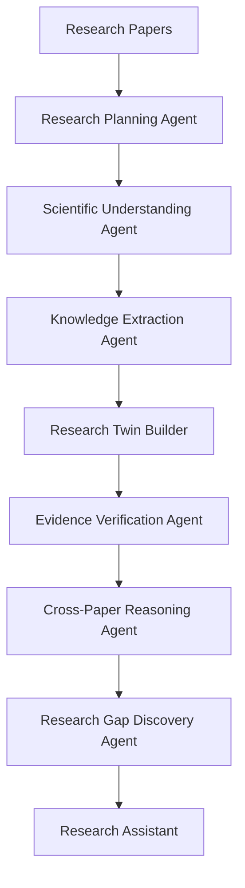
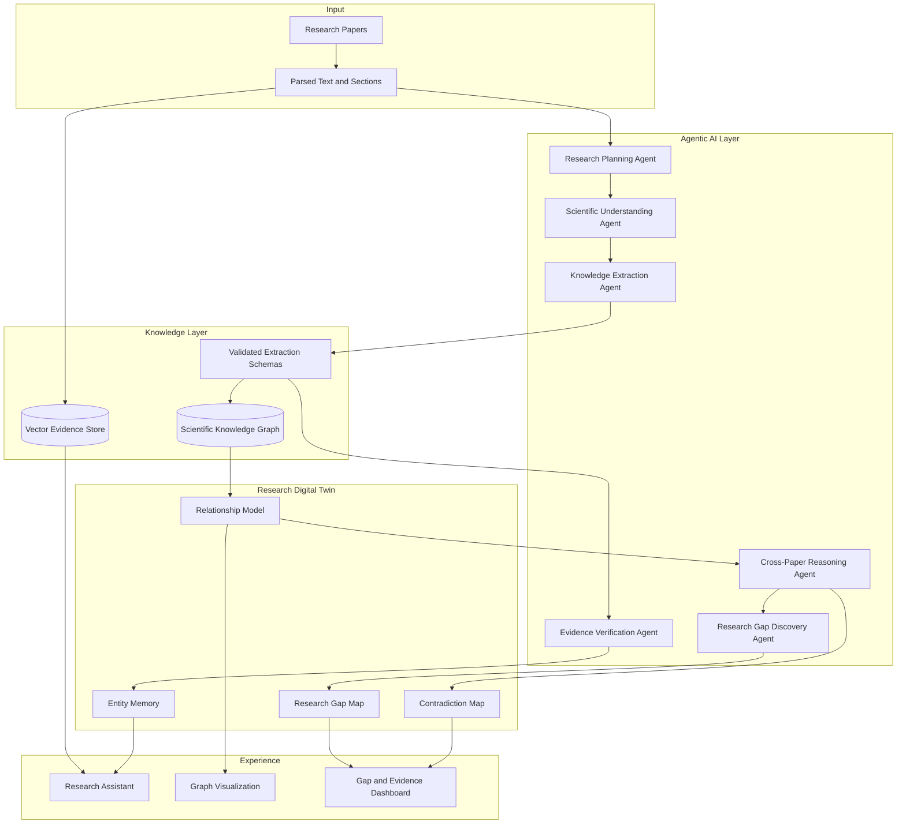
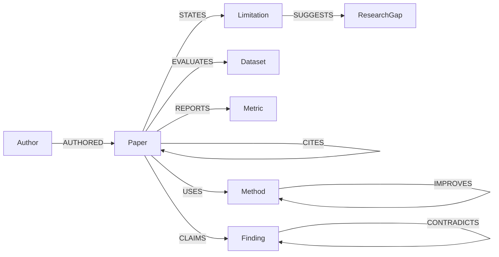

# FARQ Execution Proposal

## Executive Summary

Burhan is an Agentic AI Research Scientist that builds and continuously evolves a Research Digital Twin. The system reads research papers, extracts structured scientific knowledge, verifies evidence, reasons across papers, identifies contradictions, and detects research gaps.

The product is the Agentic AI Research Scientist. The Research Digital Twin is the core intelligence layer that allows Burhan to represent what a research field collectively knows.

For the FARQ Hackathon, the MVP will focus on one research domain and demonstrate the full workflow from papers to structured knowledge, graph relationships, evidence-backed reasoning, and research gap discovery.

## Problem

Researchers spend significant time comparing scientific papers manually. A literature review requires understanding:

- which methods are used and improved;
- which datasets and metrics are common;
- which findings are supported by evidence;
- which claims contradict each other;
- which limitations repeat across papers;
- which research gaps are meaningful.

Most existing tools help researchers find, read, summarize, or cite papers. The deeper problem is scientific understanding across papers.

## Existing Solutions

The repository positioning considers systems such as Elicit, Consensus, Connected Papers, ResearchRabbit, SciSpace, Semantic Scholar, Litmaps, and scite.

These systems provide important research support:

- Elicit helps with literature review workflows.
- Consensus answers research questions from papers.
- Connected Papers and Litmaps visualize related papers and citation neighborhoods.
- ResearchRabbit supports literature discovery and paper collections.
- SciSpace helps users read and understand individual papers.
- Semantic Scholar provides scholarly search and metadata.
- scite adds citation context and evidence signals.

## Gap Analysis

Existing systems commonly optimize individual research tasks:

- literature search;
- paper understanding;
- citation graph exploration;
- evidence synthesis.

Burhan focuses on Scientific Knowledge Intelligence. It extracts and connects scientific concepts across papers, then reasons over the resulting Research Digital Twin.

The gap is a system that continuously builds structured scientific understanding.

## Burhan

Burhan is an Agentic AI Research Scientist with the subtitle: Building Living Research Digital Twins.

Burhan autonomously:

- reads research papers;
- extracts structured knowledge;
- builds a Research Digital Twin;
- reasons across papers;
- verifies evidence;
- identifies contradictions;
- detects research gaps;
- updates knowledge when new papers are added.

## Agentic AI

Burhan uses agentic AI because research intelligence requires multiple specialized reasoning steps. The system should not depend on one large prompt that tries to summarize everything.

Each agent has a clear role, and intermediate outputs can be validated before entering the Research Digital Twin.

## Research Digital Twin

The Research Digital Twin is Burhan's evolving intelligence layer. It represents:

- papers;
- methods;
- datasets;
- metrics;
- findings;
- limitations;
- future work;
- evidence;
- relationships;
- contradictions;
- research gaps;
- trends.

When new papers are uploaded, the twin can evolve by adding new entities, strengthening existing evidence, creating new relationships, or revealing contradictions and gaps.

## Architecture

## Scientific Knowledge Graph

The graph schema represents scientific knowledge as entities and relationships.

Node types:

- Paper
- Method
- Dataset
- Metric
- Finding
- Limitation
- Research Gap
- Author

Relationship types:

- USES
- EVALUATES
- COMPARES
- CITES
- IMPROVES
- CONTRADICTS
- SUGGESTS

## AI Models

Recommended LLM:

- GPT-5 preferred;
- GPT-4.1 as fallback.

The LLM is used for scientific text understanding, structured extraction, claim normalization, cross-paper reasoning, and explanation generation. It should produce schema-constrained outputs rather than free-form summaries.

Recommended embeddings:

- text-embedding-3-large.

Embeddings support the RAG subsystem by retrieving evidence passages for grounded answers and verification.

## Methodology

Burhan combines:

- Agentic AI for workflow decomposition;
- Multi-Agent System design for specialized reasoning responsibilities;
- LLM reasoning for scientific language understanding;
- Scientific Information Extraction for structured paper knowledge;
- Knowledge Graph representation for explicit relationships;
- Retrieval-Augmented Generation for evidence grounding;
- Cross-paper reasoning for comparisons and contradictions;
- Evidence verification for traceability;
- Research gap detection from limitations, future work, missing comparisons, and contradictions.

RAG is a supporting subsystem. It grounds answers, retrieves evidence, and reduces unsupported generation. The product intelligence comes from the Research Digital Twin and Scientific Knowledge Graph.

## Implementation

Recommended implementation stack:

| Layer | Technology | Reason |
|---|---|---|
| LLM | GPT-5 or GPT-4.1 | Scientific reasoning and structured extraction |
| Embeddings | text-embedding-3-large | Evidence retrieval |
| Agent framework | LangGraph | Stateful multi-agent orchestration |
| Knowledge graph | Neo4j | Scientific relationship storage and traversal |
| Vector database | Qdrant | RAG evidence search |
| Parser | Docling and PyMuPDF | Research PDF text extraction |
| Validation | Pydantic | Strict entity and relationship schemas |
| Backend | FastAPI | Python AI service APIs |
| Frontend | Next.js | Research dashboard and visualization |

## MVP

The FARQ MVP will demonstrate one focused research domain.

Must-have outputs:

- curated paper set;
- parsed paper text;
- structured extraction schema;
- extracted methods, datasets, metrics, findings, limitations, and evidence;
- Scientific Knowledge Graph;
- Research Digital Twin view;
- cross-paper comparison;
- research gap examples;
- grounded assistant response;
- two-minute video demonstration.

Out of scope for the preliminary MVP:

- full scholarly search engine;
- large-scale citation indexing;
- user accounts;
- collaboration workflows;
- unsupported benchmark claims.

## Roadmap

| Phase | Objective | Deliverables |
|---|---|---|
| Prototype | Prove paper-to-knowledge extraction | Paper set, extraction schema, sample graph |
| FARQ MVP | Prove paper-to-twin workflow | Twin dashboard, gap cards, grounded assistant |
| Research Intelligence | Improve reasoning depth | Contradiction detection, method comparison, stronger evidence verification |
| Platform Hardening | Increase reliability | Neo4j persistence, Qdrant retrieval, LangGraph observability |
| Continuous Twin | Keep the twin evolving | Incremental updates, entity resolution, scholarly integrations |

## Impact

Burhan can help AI students, graduate researchers, research assistants, and literature-review teams understand research fields more quickly and with stronger evidence traceability.

Expected impact areas:

- less manual comparison across papers;
- clearer visibility into repeated limitations;
- more structured research gap discovery;
- better evidence grounding for research decisions;
- reusable knowledge layer for future research work.

No benchmark result is claimed until evaluation is performed.

## Team

| Name | Role |
|---|---|
| Farah Almujaljel | Product Lead & Research Twin Architect |
| Aryam Bargash | AI/LLM Engineer |
| Alaa Bughararah | Knowledge Graph & Data Engineer |
| Raneem Bahobail | Backend & System Integration |
| Batool Ashour | Frontend, UI/UX & Visualization |

Mentor:

Dr. Muzammil  
Assistant Professor of AI  
KFUPM

## FARQ Readiness

Burhan is positioned for FARQ as a technically precise, research-oriented AI platform. The preliminary demonstration should show:

- the idea evolution from Research Digital Twin positioning to Agentic AI Research Scientist;
- a clear gap in existing research tools;
- the agentic architecture;
- structured extraction and graph construction;
- evidence-backed research gap discovery;
- a realistic implementation path for the Grand Final.
