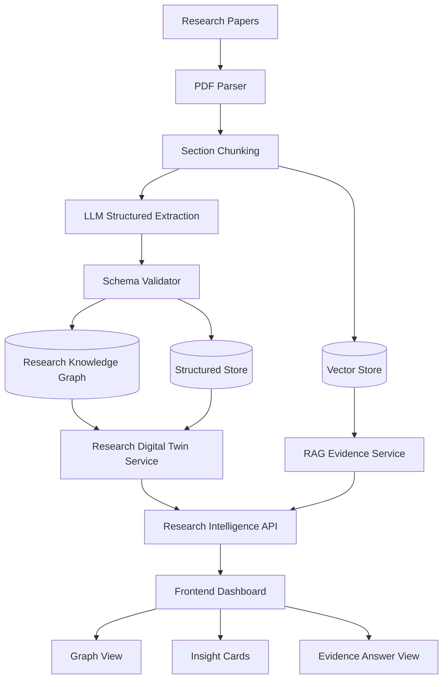
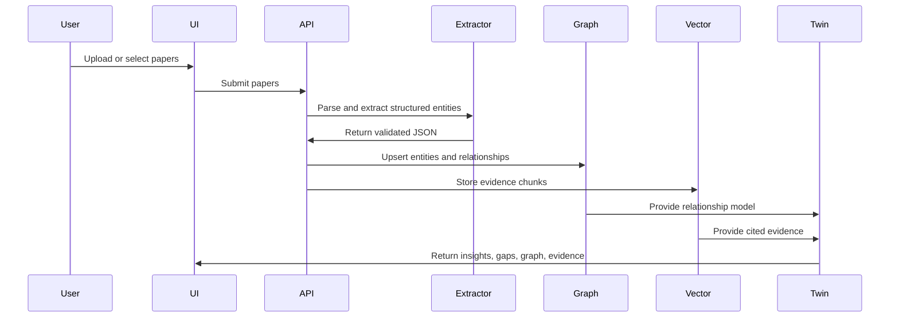
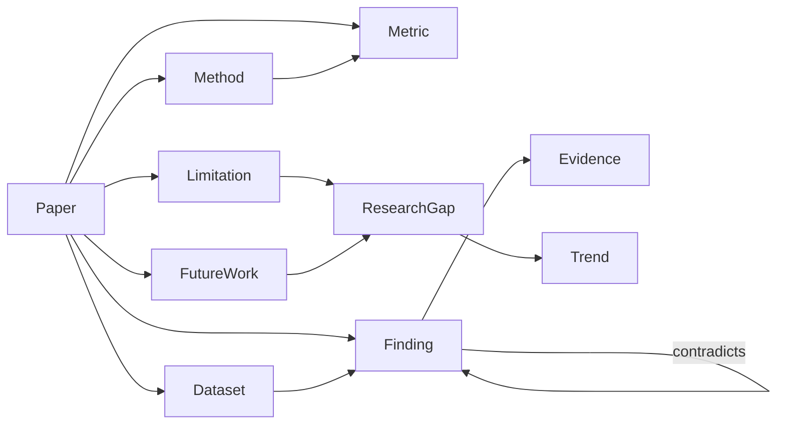

# Burhan FARQ Hackathon Execution Proposal and Action Plan

Version: 2026-09-23  
Team: Five AI students  
Project: Burhan, an evidence-driven Research Digital Twin

## Source Boundary

This proposal uses the official evaluation weights provided in the team request:

| Official criterion | Weight |
|---|---:|
| Idea & Evolution | 41% |
| Solution & Prototype | 27% |
| Feasibility & Execution | 17% |
| Impact & Sustainability | 10% |
| Presentation | 5% |

The Farq Evaluation Criteria PDF and Farq Agenda PDF were referenced in the request but were not available in the workspace. Therefore:

- Do not treat any unstated date, workshop name, venue detail, submission portal rule, or judging process in this document as official.
- Replace all `OFFICIAL_DATE_REQUIRED` placeholders with the exact dates from the Farq agenda.
- Once the PDFs are available, validate this proposal against them before final submission.
- The scoring strategy is intentionally organized around the official weights supplied above.

---

## 1. Executive Summary

### Mission

Burhan helps researchers understand what a research field collectively knows by transforming papers into a living, structured, evidence-backed Research Digital Twin.

### Project Vision

Most research assistants answer questions over documents. Burhan builds and updates a structured representation of a research domain. Every uploaded paper contributes entities, evidence, relationships, contradictions, trends, limitations, and research gaps.

The product vision is:

> Upload research papers, extract structured scientific knowledge, connect the knowledge into a continuously updateable Research Digital Twin, and provide evidence-based research intelligence.

### Why Burhan Is Different

Burhan is not a Chat with PDFs application. RAG is only one subsystem. The core system is a Research Digital Twin made of structured research entities:

- Papers
- Methods
- Datasets
- Metrics
- Findings
- Evidence
- Limitations
- Future work
- Relationships
- Contradictions
- Trends
- Research gaps

The difference judges must see:

| Common PDF chatbot | Burhan Research Digital Twin |
|---|---|
| Retrieves passages | Extracts structured scientific entities |
| Answers from isolated PDFs | Models a research domain across papers |
| Uses vector search as the main system | Uses RAG as one evidence access layer |
| Gives text answers | Gives evidence-backed intelligence, comparisons, graph relationships, and gaps |
| Static per-upload interaction | Continuously updateable domain representation |

### Why It Fits Farq

Based on the official scoring weights, Farq strongly rewards idea strength and evolution. Burhan is designed to maximize that category by showing a clear step-change from document Q&A to research intelligence. It also supports a strong prototype because the demo can visibly show papers becoming a knowledge graph, then becoming a Digital Twin, then producing research insights.

---

## 2. Success Strategy

### Evaluation Strategy Overview

| Criterion | Weight | Strategic priority | Team interpretation |
|---|---:|---|---|
| Idea & Evolution | 41% | Highest | Make the Digital Twin concept unmistakable, differentiated, and evolved through evidence |
| Solution & Prototype | 27% | Very high | Deliver a polished, reliable demo with visible extraction, graph, and intelligence outputs |
| Feasibility & Execution | 17% | High | Keep scope controlled, architecture explainable, and implementation credible |
| Impact & Sustainability | 10% | Medium | Show who benefits, why it matters, and how it can grow after Farq |
| Presentation | 5% | Medium | Use crisp storytelling, clean visuals, and a controlled demo |

### 2.1 Idea & Evolution, 41%

| Item | Plan |
|---|---|
| Goal | Prove Burhan is a novel Research Digital Twin for scientific knowledge, not a PDF chatbot. |
| Importance | This is the largest scoring category, so product framing matters as much as implementation. |
| Deliverables | Problem statement, Digital Twin concept map, before/after workflow, evidence entity schema, evolution log, research intelligence examples. |
| Evidence required | Side-by-side comparison against simple RAG; examples of extracted entities; graph relationships; contradiction/gap examples; demo showing the twin improves as papers are added. |
| How judges may evaluate it | They will likely look for originality, relevance, clarity, problem understanding, and development from idea to working concept. |
| Potential risks | Judges misunderstand it as Chat with PDFs; concept sounds too broad; no clear proof of evolution. |
| Mitigation | Repeat the distinction in the deck, demo, video, and README. Show structured extraction before any chat. Keep an evolution log with dated decisions. |
| Expected output | A judge can explain Burhan in one sentence: "It builds a living evidence graph of a research field." |

Execution actions:

1. Define the Digital Twin ontology before building features.
2. Pick one research domain for the demo, such as AI in healthcare, Arabic NLP, or medical imaging.
3. Use 5-8 papers for the preliminary demo and 12-20 papers for the final demo.
4. Build at least three intelligence outputs that cannot be reduced to PDF chat:
   - Method-to-metric comparison.
   - Limitation-to-gap aggregation.
   - Contradiction or tension map across findings.
5. Maintain an `Idea Evolution Log` with daily updates:
   - What changed?
   - Why did it improve the Digital Twin?
   - Which evaluation criterion does it strengthen?

### 2.2 Solution & Prototype, 27%

| Item | Plan |
|---|---|
| Goal | Deliver a working prototype that uploads papers, extracts structured knowledge, updates the Digital Twin, and displays evidence-backed insights. |
| Importance | The prototype proves the idea is real. Judges need to see reliability, not only ambition. |
| Deliverables | Upload flow, extraction pipeline, schema validation, knowledge graph, Digital Twin dashboard, RAG evidence assistant, demo dataset, deployment or local fallback. |
| Evidence required | Screen recording, live demo, sample JSON extraction, graph visualization, citations, test cases, fallback screenshots. |
| How judges may evaluate it | Functionality, usability, technical depth, integration, polish, and working demo quality. |
| Potential risks | Extraction fails live; graph is visually weak; RAG dominates the demo; upload/parsing is slow. |
| Mitigation | Preload demo papers; cache extraction results; prepare a recorded backup; show RAG only after the Digital Twin is visible. |
| Expected output | A stable prototype where the main story can be demonstrated in under 4 minutes. |

Prototype acceptance criteria:

- User can upload or select demo papers.
- System extracts at least: paper, method, dataset, metric, finding, evidence, limitation, future work.
- System stores extracted entities in structured form.
- System shows relationships across papers.
- System identifies at least one recurring limitation and one research gap.
- Every answer includes evidence references.
- Demo can run from a clean browser state.

### 2.3 Feasibility & Execution, 17%

| Item | Plan |
|---|---|
| Goal | Prove the team can deliver the MVP inside the hackathon timeline. |
| Importance | A strong idea loses points if judges think it is too complex or unfinished. |
| Deliverables | Architecture diagram, scoped MVP, sprint board, risk register, testing report, deployment plan, team roles. |
| Evidence required | GitHub repo, task board, README, test samples, demo script, system diagram, known limitations. |
| How judges may evaluate it | Clarity of plan, realism, working execution, division of labor, and credible technology choices. |
| Potential risks | Overbuilding; unclear ownership; too many experimental components. |
| Mitigation | Freeze MVP early. Use proven tools. Separate must-have intelligence from future vision. |
| Expected output | A project that looks ambitious but executable by five AI students. |

Feasibility rules:

- One primary demo domain only.
- One graph database or graph representation only.
- One LLM extraction path only, with manual/demo fallback.
- One UI path optimized for judging.
- No feature enters MVP unless it strengthens the Digital Twin.

### 2.4 Impact & Sustainability, 10%

| Item | Plan |
|---|---|
| Goal | Show that Burhan can reduce research discovery time and support evidence-based scientific work. |
| Importance | Judges need to see value beyond the hackathon. |
| Deliverables | Impact statement, target users, adoption path, sustainability model, future roadmap. |
| Evidence required | User stories, time-saving estimate, validation feedback, post-hackathon roadmap. |
| How judges may evaluate it | Practical value, scalability, responsible AI, and long-term usefulness. |
| Potential risks | Impact sounds generic; no clear user segment; sustainability is vague. |
| Mitigation | Focus on graduate students, research labs, and literature review teams. Quantify tasks Burhan accelerates. |
| Expected output | Clear case that Burhan turns literature review from manual reading into structured research intelligence. |

Impact hypothesis:

- Researchers spend hours manually comparing methods, datasets, metrics, and limitations.
- Burhan reduces discovery time by converting papers into structured, queryable, visual evidence.
- The system supports better literature reviews, faster gap identification, and clearer research planning.

### 2.5 Presentation, 5%

| Item | Plan |
|---|---|
| Goal | Communicate the idea clearly and make the demo memorable. |
| Importance | Although the weight is smaller, presentation affects judge perception of all categories. |
| Deliverables | Two-minute video, final deck, demo script, Q&A sheet, backup recording. |
| Evidence required | Polished story, visual diagrams, rehearsed timing, clean screenshots. |
| How judges may evaluate it | Clarity, confidence, structure, storytelling, and ability to answer questions. |
| Potential risks | Team overexplains architecture; live demo consumes too much time; unclear differentiation. |
| Mitigation | Use one story: "From papers to Digital Twin to research intelligence." Rehearse strict timing. |
| Expected output | Judges remember Burhan as a living evidence model, not as another chatbot. |

---

## 3. Project Roadmap

### Date Handling

The official agenda PDF is not available in the workspace. Use this roadmap as a phase structure and map each phase to official dates after reviewing the agenda.

| Placeholder | Meaning |
|---|---|
| `TODAY` | 2026-09-23 |
| `PRELIM_DATE` | Official preliminary submission deadline from Farq agenda |
| `FINAL_DATE` | Official Grand Final date from Farq agenda |

### Phase 1: Alignment and Scope Freeze

| Field | Detail |
|---|---|
| Timing | TODAY to TODAY + 1 day |
| Objectives | Lock the concept, scoring strategy, MVP boundaries, team roles, and demo domain. |
| Deliverables | One-page product brief, evaluation mapping, ontology v1, demo domain selected, task board. |
| Dependencies | Farq evaluation criteria; team availability; selected research papers. |
| Completion criteria | Team can explain Burhan consistently; MVP is frozen; every member has an owner area. |
| Risks | Scope creep starts early; team disagrees on technical direction. |

### Phase 2: Digital Twin Foundation

| Field | Detail |
|---|---|
| Timing | TODAY + 1 to TODAY + 3 |
| Objectives | Define schema, extraction format, graph relationships, and sample data. |
| Deliverables | Entity schema, JSON extraction examples, graph model, seed dataset, validation rubric. |
| Dependencies | Demo paper set; LLM extraction prompt; storage decision. |
| Completion criteria | At least 3 papers are represented as structured entities and relationships. |
| Risks | Extraction is inconsistent; ontology becomes too large. |

### Phase 3: Prototype Core

| Field | Detail |
|---|---|
| Timing | TODAY + 3 to TODAY + 7 |
| Objectives | Build upload/demo ingestion, extraction pipeline, storage, and initial UI. |
| Deliverables | Backend endpoints, extraction service, knowledge graph storage, dashboard skeleton. |
| Dependencies | Schema v1; selected tech stack; API keys or local model path. |
| Completion criteria | End-to-end path works with demo papers: paper input to structured Digital Twin display. |
| Risks | PDF parsing delays; LLM output variability; graph integration takes longer than expected. |

### Phase 4: Research Intelligence Layer

| Field | Detail |
|---|---|
| Timing | TODAY + 7 to PRELIM_DATE - 3 |
| Objectives | Add cross-paper intelligence that proves this is not chat with PDFs. |
| Deliverables | Method comparison, gap detection, limitation clustering, evidence answer view, graph visualization. |
| Dependencies | Reliable extracted entities; enough demo papers. |
| Completion criteria | Demo can show at least three cross-paper insights with citations. |
| Risks | Insights are shallow; graph view is hard to read. |

### Phase 5: Preliminary Submission Package

| Field | Detail |
|---|---|
| Timing | PRELIM_DATE - 3 to PRELIM_DATE |
| Objectives | Prepare the two-minute video and preliminary artifacts. |
| Deliverables | Video, README, screenshots, architecture diagram, demo recording, submission checklist. |
| Dependencies | Stable prototype; official submission instructions. |
| Completion criteria | Video is under two minutes; all artifacts are reviewed; submission is complete. |
| Risks | Video lacks evidence; late technical changes destabilize demo. |

### Phase 6: Grand Final Enhancement

| Field | Detail |
|---|---|
| Timing | PRELIM_DATE + 1 to FINAL_DATE - 4 |
| Objectives | Increase polish, reliability, impact evidence, and final demo quality. |
| Deliverables | Improved UI, larger paper set, QA report, user feedback, final deck, Q&A bank. |
| Dependencies | Preliminary feedback; final agenda; judge expectations. |
| Completion criteria | Final demo is rehearsed; all scoring criteria have visible evidence. |
| Risks | New features create instability; team under-rehearses. |

### Phase 7: Final Rehearsal and Submission

| Field | Detail |
|---|---|
| Timing | FINAL_DATE - 4 to FINAL_DATE |
| Objectives | Freeze product, rehearse, prepare backup, and submit final materials. |
| Deliverables | Final deck, live demo, backup video, technical appendix, final README, deployment link. |
| Dependencies | Stable prototype; official final requirements. |
| Completion criteria | Team can complete presentation within time; backup plan is ready; repo is clean. |
| Risks | Demo failure; unclear speaking handoffs; Q&A surprises. |

---

## 4. Work Breakdown Structure

| Workstream | Purpose | Tasks | Dependencies | Expected outputs | Definition of Done |
|---|---|---|---|---|---|
| Product Strategy | Maximize official scoring | Define problem, positioning, MVP, scoring map | Evaluation criteria | Product brief, pitch narrative | Team uses same language in README, video, and deck |
| Research Intelligence | Create non-chat value | Define insights, gap logic, contradiction examples | Extracted entities | Method comparison, gap cards, trend summaries | At least 3 cross-paper insights with evidence |
| Extraction Pipeline | Convert papers into structured knowledge | Parse PDFs, chunk sections, prompt LLM, validate JSON | Demo papers, LLM | Structured extraction records | 5 papers extract with acceptable quality |
| Knowledge Graph | Represent the Digital Twin | Define nodes, edges, graph storage, update rules | Schema | Graph model and visualization data | Graph shows papers, methods, datasets, findings, limitations |
| Backend | Serve reliable APIs | Upload, extraction, twin update, query endpoints | Schema and storage | API layer | Demo flow works repeatedly |
| Frontend | Make value visible | Upload view, Twin dashboard, graph, insights, evidence answer | Backend APIs | Polished user interface | Judge can understand system in 30 seconds |
| LLM Integration | Power extraction and evidence answers | Extraction prompts, answer prompts, guardrails, JSON repair | LLM access | Prompt templates and model calls | Outputs cite evidence and match schema |
| RAG Subsystem | Retrieve evidence, not define product | Embeddings, vector store, cited answer generation | Parsed text | Evidence-backed assistant | RAG is shown after Digital Twin views |
| Testing and QA | Reduce live-demo risk | Test papers, extraction checks, citation checks, UI checks | Prototype | QA report | Critical demo path passes twice |
| Demo | Tell the product story | Script, dataset, backup recording, rehearsals | Stable prototype | Final demo package | Demo runs within assigned time |
| Presentation | Convert work into score | Deck, video, Q&A, speaking order | Product narrative | Final presentation | Team can present without confusion |
| Documentation | Make execution credible | README, architecture, setup, limitations, roadmap | All workstreams | Submission docs | Repo explains project clearly |
| Deployment | Ensure access | Local fallback, hosted app if feasible, seeded demo data | Stable app | Deployment link or local script | Demo can run even if internet/API fails |

---

## 5. Team Action Plan

### Team Roles

| Member | Role | Primary responsibility | Secondary support |
|---|---|---|---|
| Member 1 | Product Lead and Presentation Owner | Scoring strategy, narrative, deck, video script | QA and user validation |
| Member 2 | AI Extraction Lead | Paper parsing, LLM extraction, schema validation | RAG evidence answers |
| Member 3 | Knowledge Graph Lead | Ontology, graph model, Digital Twin update logic | Visualization data |
| Member 4 | Backend and Integration Lead | APIs, storage, pipeline orchestration, deployment | Testing |
| Member 5 | Frontend and Demo Lead | UI, graph view, insight screens, demo polish | Video recording |

### Weekly Responsibilities

| Member | Weekly tasks | Deliverables | Dependencies | Review checkpoints |
|---|---|---|---|---|
| Member 1 | Maintain evaluation map; write script; run rehearsals | Product brief, deck, video storyboard | Prototype screenshots | Daily narrative review |
| Member 2 | Improve extraction prompts; validate outputs | Extraction JSON, prompt docs, quality report | Demo paper set | Twice-daily extraction review |
| Member 3 | Build graph schema; map entities; generate insights | Ontology, graph relationships, gap logic | Extraction records | Daily graph review |
| Member 4 | Implement endpoints; connect storage; prepare deployment | Backend APIs, setup guide, seeded data | Schema and frontend needs | Daily integration review |
| Member 5 | Build UI; polish demo; record screen flows | Dashboard, graph UI, demo recording | Backend APIs | Daily demo run |

### Review Rhythm

| Time | Meeting | Purpose |
|---|---|---|
| Morning | 15-minute standup | Blockers, daily priorities, ownership |
| Afternoon | Integration check | Confirm components connect |
| Evening | Demo checkpoint | Run the demo path and capture evidence |
| Every 2 days | Scoring review | Confirm work maps to evaluation weights |
| Before submission | Readiness review | Freeze, rehearse, package, submit |

---

## 6. MVP Definition

### Must Have

| Feature | Why it belongs |
|---|---|
| Upload or select research papers | Required starting point for the Digital Twin workflow |
| Structured extraction into schema | Core distinction from PDF chat |
| Research Knowledge Graph | Main representation of relationships |
| Digital Twin dashboard | Makes the concept visible to judges |
| Cross-paper method/dataset/metric comparison | Proves field-level intelligence |
| Limitation and research gap aggregation | Strongly supports idea impact |
| Evidence-linked answers | Maintains trust and scientific grounding |
| Two-minute preliminary video | Required by the request for preliminary evaluation |
| Backup demo recording | Reduces live-demo risk |

### Should Have

| Feature | Why it belongs |
|---|---|
| Contradiction detection | Strong differentiator, but can be heuristic for MVP |
| Trend view | Useful for research intelligence if time allows |
| Confidence scores for extractions | Improves trust and QA |
| Exportable insight report | Useful for judges and researchers |
| Larger paper dataset | Strengthens credibility after core works |

### Could Have

| Feature | Why it belongs |
|---|---|
| Multi-domain support | Valuable but risks diluting demo focus |
| Collaborative annotations | Nice product feature, not core to scoring |
| Advanced citation graph | Useful, but not necessary for MVP |
| Semantic clustering visualization | Good polish if graph is already reliable |

### Future Work

| Feature | Why it belongs |
|---|---|
| Automated literature monitoring | Natural Digital Twin evolution after hackathon |
| Research lab workspace | Sustainability and adoption path |
| Integration with academic databases | Strong long-term product direction |
| Human-in-the-loop validation | Important for research-grade quality |
| Benchmark extraction evaluation | Required for serious scientific deployment |

MVP decision question:

> Does this strengthen the Digital Twin, or is it merely another RAG feature?

If the answer is "merely RAG," defer it unless it directly improves evidence citation.

---

## 7. Technical Architecture Plan

### System Architecture



### Data Flow



### Knowledge Graph Model



### Component Plan

| Component | Responsibility | Recommended MVP approach |
|---|---|---|
| PDF parser | Extract text and sections | Use reliable library; cache parsed text |
| Extraction service | Convert paper text to structured JSON | Prompted LLM with strict schema and validation |
| Schema validator | Prevent invalid entities | JSON schema or typed validation |
| Knowledge graph | Store relationships | Neo4j if ready; otherwise structured graph JSON for demo |
| Vector store | Retrieve evidence chunks | Lightweight vector DB or local embeddings store |
| Digital Twin service | Combine graph + evidence + insights | Deterministic aggregation plus LLM explanation |
| Backend API | Serve upload, extraction, twin, query endpoints | FastAPI or existing selected backend |
| Frontend | Present workflow and insights | Dashboard-first UI |
| LLM | Extraction and explanation | Use constrained prompts and cached demo outputs |
| Visualization | Show graph and research intelligence | Force-directed graph or node-link view |

### Extraction Schema, MVP

```json
{
  "paper": {
    "title": "string",
    "authors": ["string"],
    "year": "number",
    "domain": "string"
  },
  "methods": [{"name": "string", "description": "string"}],
  "datasets": [{"name": "string", "size": "string", "domain": "string"}],
  "metrics": [{"name": "string", "value": "string", "context": "string"}],
  "findings": [{"claim": "string", "evidence_text": "string", "section": "string"}],
  "limitations": [{"description": "string", "evidence_text": "string"}],
  "future_work": [{"description": "string"}],
  "relationships": [
    {"source": "string", "type": "supports|contradicts|uses|evaluated_on|reports", "target": "string"}
  ]
}
```

### Digital Twin Update Rule

Each new paper must:

1. Add or merge paper-level metadata.
2. Add methods, datasets, metrics, findings, limitations, and future work.
3. Link entities to evidence.
4. Merge duplicate entities where names are semantically equivalent.
5. Recompute cross-paper summaries:
   - Recurring methods.
   - Most used datasets.
   - Best reported metrics.
   - Repeated limitations.
   - Emerging research gaps.
   - Contradictory findings.

---

## 8. Sprint Plan

### Sprint 0: Setup and Scope, 0.5-1 Day

| Task | Owner | Effort | Dependencies | Acceptance criteria |
|---|---|---:|---|---|
| Confirm official dates from agenda | Member 1 | 1h | Agenda PDF | Roadmap has exact dates |
| Select demo domain and papers | Members 1, 2 | 2h | Paper availability | 5-8 preliminary papers chosen |
| Freeze MVP | All | 1h | Evaluation criteria | Must/should/could list approved |
| Create task board | Member 1 | 1h | Team roles | Every task has owner and due date |

### Sprint 1: Ontology and Extraction, 1-2 Days

| Task | Owner | Effort | Dependencies | Acceptance criteria |
|---|---|---:|---|---|
| Define schema v1 | Members 2, 3 | 3h | MVP | Schema covers required entities |
| Build extraction prompt | Member 2 | 4h | Schema | LLM returns valid JSON for 3 papers |
| Validate extraction manually | Members 1, 2 | 3h | Demo papers | QA table has precision notes |
| Create seed output fallback | Member 2 | 2h | Extraction results | Demo can run from cached data |

### Sprint 2: Graph and Backend, 2-3 Days

| Task | Owner | Effort | Dependencies | Acceptance criteria |
|---|---|---:|---|---|
| Implement entity storage | Member 4 | 5h | Schema | Extracted records persist |
| Implement graph upsert | Members 3, 4 | 6h | Graph model | Relationships visible in API |
| Build Digital Twin aggregation | Member 3 | 5h | Graph data | Gaps and method comparisons returned |
| Add evidence retrieval | Members 2, 4 | 4h | Parsed chunks | Answers include source evidence |

### Sprint 3: Frontend and Demo Flow, 2-3 Days

| Task | Owner | Effort | Dependencies | Acceptance criteria |
|---|---|---:|---|---|
| Build dashboard layout | Member 5 | 5h | API contracts | Main screen shows Digital Twin state |
| Build graph visualization | Member 5 | 6h | Graph API | Nodes and edges render clearly |
| Build insight cards | Members 3, 5 | 4h | Aggregations | Cards show evidence and confidence |
| Build answer view | Members 2, 5 | 4h | RAG API | Answers cite evidence |

### Sprint 4: Preliminary Package, 2 Days

| Task | Owner | Effort | Dependencies | Acceptance criteria |
|---|---|---:|---|---|
| Record demo clips | Member 5 | 3h | Stable UI | Clips cover upload, graph, insights |
| Produce two-minute video | Members 1, 5 | 6h | Script and clips | Video is under two minutes |
| Update README | Members 1, 4 | 2h | Architecture | README clearly says not PDF chat |
| Run readiness checklist | All | 2h | Artifacts | No missing preliminary item |

### Sprint 5: Final Enhancement

| Task | Owner | Effort | Dependencies | Acceptance criteria |
|---|---|---:|---|---|
| Add more papers | Member 2 | 4h | Stable extraction | 12-20 papers in demo dataset |
| Improve contradiction/gap examples | Member 3 | 5h | Larger dataset | At least 2 strong examples |
| Polish UI | Member 5 | 6h | Feedback | Demo looks coherent on projector |
| Collect user feedback | Member 1 | 3h | Prototype | 3-5 feedback notes documented |
| Harden deployment | Member 4 | 5h | App stability | Hosted or local fallback ready |

---

## 9. Daily Execution Checklist

### Morning

- [ ] Review official deadline countdown.
- [ ] Confirm each member's top three tasks.
- [ ] Identify blockers.
- [ ] Confirm whether any task strengthens the Digital Twin.
- [ ] Update task board.

### Afternoon

- [ ] Integrate completed work.
- [ ] Run extraction on at least one demo paper.
- [ ] Check graph output.
- [ ] Confirm frontend receives expected data.
- [ ] Save screenshots or clips of progress.

### Evening

- [ ] Run the current demo path.
- [ ] Record failures and fixes.
- [ ] Update README or internal notes.
- [ ] Review scoring evidence.
- [ ] Decide what must be done tomorrow.

### Team Sync

- [ ] Each person reports done, next, blocked.
- [ ] Product Lead checks alignment with scoring.
- [ ] Demo Lead checks visual/story quality.
- [ ] Backend and AI leads confirm integration status.

### Review

- [ ] Does the demo still show a Digital Twin first?
- [ ] Are insights evidence-backed?
- [ ] Is RAG presented only as supporting evidence retrieval?
- [ ] Is any feature becoming scope creep?

### Testing

- [ ] Upload/demo papers work.
- [ ] Cached fallback works.
- [ ] Graph renders.
- [ ] Citations are correct.
- [ ] Two-minute video assets are current.

### Documentation

- [ ] Update architecture diagram if changed.
- [ ] Update limitations honestly.
- [ ] Update task board.
- [ ] Save evidence examples.

---

## 10. Risk Register

| Risk | Likelihood | Impact | Mitigation | Owner |
|---|---|---|---|---|
| Scope creep | High | High | Freeze MVP; use Digital Twin test for every feature | Member 1 |
| Judges think it is PDF chat | Medium | High | Show graph and structured extraction before chat | Member 1 |
| Poor extraction quality | High | High | Strict schema, manual QA, cached fallback | Member 2 |
| PDF parsing fails | Medium | High | Pre-parse demo papers; provide text fallback | Member 2 |
| Graph too complex | Medium | Medium | Limit node types; use clear colors and labels | Member 3 |
| Weak research gaps | Medium | High | Use demo domain with visible recurring limitations | Member 3 |
| Backend integration delays | Medium | High | Mock API early; integrate daily | Member 4 |
| Deployment failure | Medium | High | Local demo and video backup | Member 4 |
| UI looks unfinished | Medium | Medium | Prioritize demo screens over full app | Member 5 |
| Live demo fails | Medium | High | Seed data, cached responses, backup recording | Member 5 |
| Lack of evidence for claims | Medium | High | Every insight links to paper and evidence text | Members 2, 3 |
| Presentation overruns | Medium | Medium | Rehearse with timer; strict speaker roles | Member 1 |
| Agenda workshop missed | Unknown | Medium | Validate official agenda; assign attendance | Member 1 |
| LLM cost or limits | Medium | Medium | Cache outputs; reduce paper count; batch extraction | Member 2 |
| Team coordination gaps | Medium | Medium | Daily sync and owner-based tasks | All |

---

## 11. Demo Strategy

### Demo Goal

Demonstrate that Burhan converts papers into a living Research Digital Twin and then uses that twin to produce evidence-based research intelligence.

### Demo Flow

| Step | Screen | Message | Judge expectation addressed |
|---|---|---|---|
| 1 | Demo domain overview | "We start with a focused research domain." | Feasibility |
| 2 | Paper upload or selected papers | "These papers are not just stored; they become structured knowledge." | Prototype |
| 3 | Extraction preview | "Burhan extracts methods, datasets, metrics, findings, evidence, limitations, and future work." | Idea & prototype |
| 4 | Knowledge graph | "The extracted entities become a Research Digital Twin." | Core innovation |
| 5 | Method comparison | "Now the system compares the field, not a single PDF." | Differentiation |
| 6 | Gap detection | "Recurring limitations become research gaps." | Impact |
| 7 | Evidence answer | "RAG retrieves evidence, but the Digital Twin guides the intelligence." | Trust |
| 8 | Add new paper | "The twin updates continuously." | Evolution |

### Storytelling

Use this phrase repeatedly:

> Burhan does not ask, "What does this PDF say?" It asks, "What does this research field collectively know?"

### Screens Required

- Upload or paper selection screen.
- Extraction result screen.
- Digital Twin graph screen.
- Research intelligence dashboard.
- Evidence-backed answer screen.
- Gap and limitation screen.

### Transitions

1. Problem to papers: "Researchers do not struggle because papers are inaccessible; they struggle because knowledge is fragmented."
2. Papers to extraction: "The first step is turning text into scientific structure."
3. Extraction to graph: "Structure becomes relationships."
4. Graph to insight: "Relationships become research intelligence."
5. Insight to evidence: "Every claim remains traceable to the source."

### Backup Plan

- Keep cached extracted JSON.
- Keep seeded graph data.
- Keep local screenshots.
- Keep a full backup video.
- If upload fails, start from "preloaded demo dataset."
- If LLM fails, explain cached extraction was generated earlier for demo reliability.

---

## 12. Presentation Strategy

### Slide Plan

| Slide | Title | Owner | Purpose |
|---:|---|---|---|
| 1 | Burhan | Member 1 | Name, mission, one-line value |
| 2 | Research Is Fragmented | Member 1 | Problem and user pain |
| 3 | Not Chat with PDFs | Member 1 | Differentiation |
| 4 | Research Digital Twin | Member 3 | Core concept and ontology |
| 5 | Architecture | Member 4 | Technical credibility |
| 6 | Live Demo | Member 5 | Prototype proof |
| 7 | Evidence-Based Intelligence | Member 2 | Extraction and citations |
| 8 | Impact | Member 1 | Users, value, sustainability |
| 9 | Roadmap | Member 4 | Feasibility and future |
| 10 | Closing | Member 1 | Why Burhan deserves to advance |

### Speaking Order

| Speaker | Time | Role |
|---|---:|---|
| Member 1 | 45-60s | Problem, vision, evaluation-aligned story |
| Member 3 | 45-60s | Digital Twin and knowledge graph |
| Member 5 | 2-3m | Live demo |
| Member 2 | 45-60s | Extraction quality and evidence |
| Member 4 | 45-60s | Feasibility, architecture, deployment |
| Member 1 | 20-30s | Impact and close |

Adjust timing to the official final presentation limit from the agenda PDF.

### Q&A Preparation

| Likely question | Answer direction |
|---|---|
| How is this different from RAG? | RAG retrieves evidence; Burhan structures and updates a domain model. |
| How accurate is extraction? | We validate against schema, cite evidence, and expose confidence/limitations. |
| Can it scale? | The architecture separates parsing, extraction, graph storage, vector retrieval, and intelligence APIs. |
| What is the MVP limitation? | Current demo focuses on one domain and curated papers to prove the Digital Twin workflow. |
| Why does this matter? | It reduces manual literature review effort and helps identify gaps and contradictions. |

---

## 13. Two-Minute Video Plan

### Video Structure

| Time | Scene | Visuals | Narration | Evidence shown |
|---:|---|---|---|---|
| 0:00-0:10 | Hook | Fast montage of papers, highlighted methods, datasets, limitations | "Researchers do not need another PDF chatbot. They need a way to understand what an entire field knows." | Research paper collection |
| 0:10-0:25 | Problem | Manual comparison table, messy notes | "Literature review means comparing methods, datasets, metrics, findings, and gaps across many papers." | Pain points |
| 0:25-0:40 | Burhan vision | Product logo and workflow | "Burhan turns papers into a living Research Digital Twin." | Workflow diagram |
| 0:40-0:58 | Extraction | Screen recording of structured extraction | "Each paper becomes structured scientific knowledge: methods, datasets, metrics, findings, evidence, limitations, and future work." | JSON/cards |
| 0:58-1:15 | Digital Twin | Graph visualization | "Those entities connect into a knowledge graph that updates as new papers are added." | Nodes and edges |
| 1:15-1:35 | Intelligence | Method comparison and gap cards | "Burhan then surfaces research intelligence: repeated limitations, method comparisons, evidence-backed gaps, and contradictions." | Insight cards |
| 1:35-1:48 | Evidence answer | Cited answer view | "RAG is used only to retrieve supporting evidence. The Digital Twin is the core." | Citations |
| 1:48-2:00 | Close | Dashboard and team name | "Burhan helps researchers move from scattered papers to evidence-driven decisions." | Final product shot |

### Script

Researchers do not need another PDF chatbot. They need a way to understand what an entire research field knows.

Burhan is a Research Digital Twin for scientific knowledge. We upload research papers, extract structured entities such as methods, datasets, metrics, findings, evidence, limitations, and future work, then connect them into a living knowledge graph.

Unlike simple RAG tools, Burhan does not stop at retrieving passages. It compares studies, identifies repeated limitations, surfaces research gaps, and keeps every insight tied to evidence.

As new papers are added, the Digital Twin updates. Researchers can see which methods perform best, which datasets are common, where findings support or contradict each other, and what future work is still open.

Burhan turns scattered papers into evidence-driven research intelligence.

### Production Checklist

- [ ] Record clean browser clips.
- [ ] Use captions for key terms: "Extract", "Connect", "Update", "Evidence".
- [ ] Avoid showing raw chat as the primary visual.
- [ ] Show graph before answer view.
- [ ] Keep final export under two minutes.
- [ ] Save backup versions.

---

## 14. Deliverables Checklist

### Product and Strategy

- [ ] One-page product brief.
- [ ] Evaluation criteria mapping.
- [ ] MVP definition.
- [ ] Idea Evolution Log.
- [ ] Impact statement.
- [ ] Sustainability roadmap.

### Technical

- [ ] Architecture diagram.
- [ ] Data flow diagram.
- [ ] Knowledge graph model.
- [ ] Extraction schema.
- [ ] Prompt templates.
- [ ] API documentation.
- [ ] Deployment instructions.
- [ ] Demo seed data.

### Prototype

- [ ] Upload or selected-paper flow.
- [ ] Extraction preview.
- [ ] Research Knowledge Graph.
- [ ] Digital Twin dashboard.
- [ ] Method comparison view.
- [ ] Limitation and gap view.
- [ ] Evidence-backed answer view.
- [ ] Backup local demo path.

### Evidence and QA

- [ ] Research extraction examples.
- [ ] Citation validation table.
- [ ] Testing report.
- [ ] Known limitations list.
- [ ] User feedback notes.
- [ ] Screenshots.
- [ ] Backup demo video.

### Submission and Presentation

- [ ] Two-minute video.
- [ ] Final pitch deck.
- [ ] Speaker notes.
- [ ] Q&A bank.
- [ ] GitHub repository.
- [ ] README.
- [ ] Final checklist.

---

## 15. Quality Assurance Plan

### Testing Areas

| Area | Test | Acceptance criteria |
|---|---|---|
| PDF parsing | Parse each demo paper | Text is readable and section-like |
| Extraction | Compare extracted JSON to paper | Required fields are present and evidence is plausible |
| Schema validation | Run validator | Invalid fields are rejected or repaired |
| Graph | Inspect nodes and edges | Entities connect correctly |
| RAG evidence | Ask known questions | Answers cite correct papers |
| Gap detection | Review generated gaps | Gaps come from repeated limitations/future work |
| UI | Run demo path | No broken screens in rehearsal |
| Deployment | Start from fresh environment | Demo loads and data appears |
| Video | Watch full export | Under two minutes and message is clear |

### Evaluation Metrics

| Metric | Target |
|---|---|
| Required entity coverage | 90%+ of demo papers include paper, method, finding, evidence, limitation |
| Citation traceability | 100% of displayed insights link to source paper/evidence text |
| Demo reliability | Demo path passes 3 consecutive rehearsals |
| Video duration | Less than or equal to 2 minutes |
| Judge comprehension | A test viewer can explain Digital Twin distinction after watching |

### Evidence Collection

Create an evidence folder with:

- Extracted JSON examples.
- Screenshots of graph.
- Screenshots of insight cards.
- Table mapping insights to papers.
- Demo rehearsal notes.
- User feedback notes.

### Research Extraction Validation

For each paper, manually review:

- Title and year.
- Main method.
- Dataset used.
- Metrics reported.
- Key finding.
- Limitation.
- Future work.
- Evidence text.

Score each field:

| Score | Meaning |
|---:|---|
| 2 | Correct and evidence-backed |
| 1 | Partially correct |
| 0 | Missing or wrong |

### Citation Validation

Every displayed insight must pass:

- [ ] Source paper exists in uploaded set.
- [ ] Evidence text supports the insight.
- [ ] The answer does not invent unsupported claims.
- [ ] If uncertain, uncertainty is shown.

### User Testing

Ask 3-5 classmates or researchers:

1. What do you think Burhan does?
2. How is it different from a PDF chatbot?
3. Which screen is most convincing?
4. What confused you?
5. Would this help with literature review?

Use answers to improve the pitch and UI.

---

## 16. Final Submission Readiness Checklist

### Official Requirements

- [ ] Farq Evaluation Criteria PDF reviewed.
- [ ] Farq Agenda PDF reviewed.
- [ ] Preliminary deadline confirmed.
- [ ] Grand Final date confirmed.
- [ ] Submission format confirmed.
- [ ] Required file types confirmed.
- [ ] Team member information complete.
- [ ] Submission portal tested.

### Product

- [ ] MVP scope frozen.
- [ ] Demo dataset ready.
- [ ] Digital Twin graph works.
- [ ] Extraction examples ready.
- [ ] Insight examples ready.
- [ ] Evidence citations ready.
- [ ] Limitations stated honestly.

### Technical

- [ ] App runs locally.
- [ ] Hosted version works if used.
- [ ] Seed data works.
- [ ] API keys configured or fallback ready.
- [ ] README setup instructions are clear.
- [ ] Backup recording exists.
- [ ] No critical broken path remains.

### Presentation

- [ ] Two-minute video exported and reviewed.
- [ ] Final deck complete.
- [ ] Speaker order rehearsed.
- [ ] Demo script rehearsed.
- [ ] Q&A bank reviewed.
- [ ] Timing checked.
- [ ] Backup screenshots prepared.

### Scoring Evidence

- [ ] Idea & Evolution evidence visible.
- [ ] Solution & Prototype evidence visible.
- [ ] Feasibility & Execution evidence visible.
- [ ] Impact & Sustainability evidence visible.
- [ ] Presentation polish complete.

### Final Question Before Submission

For every artifact, ask:

> Does this strengthen the Research Digital Twin story, or does it make Burhan look like another RAG chatbot?

If it weakens the Digital Twin story, remove it or reframe it.

---

## Agenda and Workshop Prioritization Guide

The agenda PDF is required before naming specific sessions. Until then, prioritize any official Farq sessions in this order:

| Priority | Session type | Why it matters |
|---:|---|---|
| 1 | Evaluation criteria or judging workshop | Directly improves scoring strategy |
| 2 | Pitching and storytelling workshop | Helps convert technical work into judge-ready narrative |
| 3 | Prototype/demo workshop | Improves Solution & Prototype score |
| 4 | Mentor office hours | Fast feedback on differentiation and feasibility |
| 5 | Technical AI/product sessions | Useful only if they unblock the MVP |
| 6 | General inspiration sessions | Attend only if core build work is stable |

Attendance rule:

- At least one member attends every scoring, judging, or mentor session.
- The attendee must produce a 5-bullet summary within one hour.
- Any recommendation from a workshop must be mapped to an evaluation criterion before implementation.

---

## Immediate Next Actions

1. Add the missing Farq Evaluation Criteria PDF and Agenda PDF to the workspace.
2. Replace all official date placeholders.
3. Choose the demo research domain.
4. Select 5-8 preliminary papers.
5. Freeze the extraction schema.
6. Assign the five team roles.
7. Start the Idea Evolution Log today.
8. Build the first end-to-end demo with cached data before adding more features.
