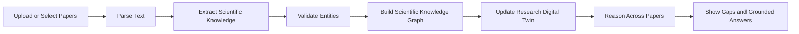

# MVP Plan

## MVP Objective

The MVP should prove that Burhan can act as an Agentic AI Research Scientist for one focused research domain. The goal is not to index the entire literature. The goal is to show that papers can become a living Research Digital Twin.

## Core Workflow

## Must Have

- One focused research domain.
- A small curated set of research papers.
- PDF parsing or pre-parsed paper text.
- Structured extraction for Paper, Method, Dataset, Metric, Finding, Limitation, Research Gap, and Author.
- Pydantic validation for extracted objects.
- Scientific Knowledge Graph schema.
- Research Digital Twin dashboard or graph view.
- Evidence-backed gap examples.
- Cross-paper comparison of at least methods, datasets, or limitations.
- Grounded assistant response using RAG as a support subsystem.

## Should Have

- Confidence labels for extracted claims.
- Evidence snippets connected to findings.
- Contradiction examples if the selected paper set supports them.
- Cached demo data to reduce presentation risk.
- Exportable summary of research gaps.

## Out of Scope for MVP

- Full scholarly search engine.
- Large-scale citation indexing.
- User accounts and collaboration.
- Multi-language support.
- Autonomous publication monitoring.
- Benchmark claims not supported by evaluation.

## Prototype Milestones

| Milestone | Output |
|---|---|
| Paper set selected | 5 to 8 papers in one domain |
| Schema defined | Validated entity and relationship model |
| Extraction proof | At least 3 papers converted into structured knowledge |
| Graph proof | Nodes and relationships visible in a graph |
| Twin proof | Dashboard shows entities, gaps, and cross-paper links |
| Evidence proof | Assistant answer includes source-grounded support |
| FARQ proof | 2-minute video shows progress and readiness |

## Acceptance Criteria

- A judge can understand the product within 20 seconds.
- The demo shows extraction before assistant chat.
- The Research Digital Twin is visible through a graph, dashboard, or structured view.
- At least one research gap is derived from extracted limitations or future work.
- Claims shown in the demo are tied to evidence.
